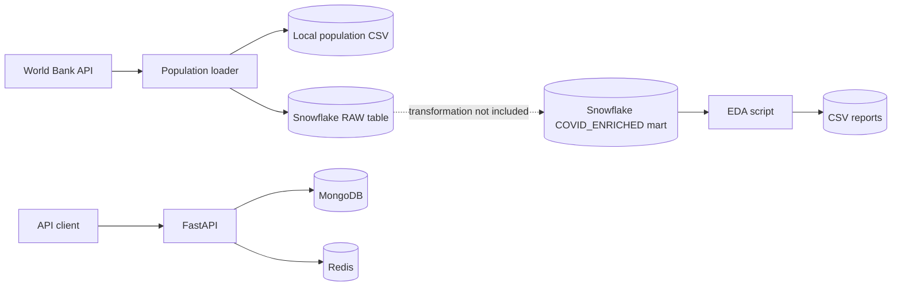

# COVID-19 Analytics Platform

A bootcamp data-engineering project that combines World Bank population data,
Snowflake analytics, a FastAPI service, MongoDB, and Redis. The repository
currently provides a reproducible development and container environment,
population ingestion, automated exploratory-data-analysis exports, and API
dependency health checks.

## Current capabilities

- Downloads 2020 country population data from the World Bank API.
- Saves the population dataset locally and loads it into Snowflake.
- Runs a set of analytical queries against an existing Snowflake mart and
  exports their results as CSV files.
- Runs FastAPI together with MongoDB and Redis through Docker Compose.
- Exposes API status and MongoDB/Redis health endpoints.
- Locks Python dependencies with uv and runs Ruff, isort, and Black locally and
  in GitHub Actions.

The API does not yet expose COVID-19 analytical queries, store application data
in MongoDB, or cache responses in Redis. Dashboarding, forecasting, and the
Snowflake RAW-to-MARTS transformation are also outside the current
implementation.

## Architecture



## Technology stack

| Area                  | Technology                                     |
| --------------------- | ---------------------------------------------- |
| API                   | FastAPI, Uvicorn                               |
| Analytics             | pandas, Snowflake Connector for Python         |
| External data         | World Bank API                                 |
| Operational data      | MongoDB 7.0                                    |
| Cache                 | Redis 7.4                                      |
| Dependency management | uv, `pyproject.toml`, `uv.lock`                |
| Runtime               | Python 3.12.13                                 |
| Containers            | Docker Compose                                 |
| Code quality          | Ruff, isort, Black, pre-commit, GitHub Actions |

## Prerequisites

For the containerized API stack:

- Docker Desktop or Docker Engine with Docker Compose
- Git

For local development and the Snowflake scripts:

- [uv](https://docs.astral.sh/uv/getting-started/installation/)
- Access to a Snowflake account

uv reads `.python-version` and can install the project's pinned Python version
automatically.

## Quick start with Docker

1. Create the local environment file:

   ```bash
   cp .env.example .env
   ```

2. Replace the placeholder values in `.env`. At minimum, use a new MongoDB
   password. Because the password is interpolated into a MongoDB URI, an
   alphanumeric password is the simplest option; otherwise it must be URL
   encoded.

3. Build and start the stack:

   ```bash
   docker compose up --build -d
   ```

4. Check the containers and API:

   ```bash
   docker compose ps
   curl http://localhost:8000/
   curl http://localhost:8000/health
   ```

   A healthy response looks like this:

   ```json
   {
     "status": "ok",
     "mongodb": "ok",
     "redis": "ok"
   }
   ```

5. Open the interactive API documentation at
   <http://localhost:8000/docs>.

6. Stop the stack when finished:

   ```bash
   docker compose down
   ```

The Compose configuration is intended for development: it bind-mounts the
repository and starts Uvicorn with automatic reload. Use a separate production
configuration before exposing the service publicly.

MongoDB and Redis data are stored in named Docker volumes. To remove the
containers **and all persisted local database/cache data**, run
`docker compose down -v`.

### Docker services

| Service | Container     | Host access             | Purpose                |
| ------- | ------------- | ----------------------- | ---------------------- |
| `api`   | `covid_api`   | <http://localhost:8000> | FastAPI application    |
| `mongo` | `covid_mongo` | `127.0.0.1:27017`       | Application data store |
| `redis` | `covid_redis` | Internal only           | API cache dependency   |

Useful operational commands:

```bash
docker compose logs -f api
docker compose restart api
docker compose build api
docker compose exec api python --version
```

## API endpoints

| Method | Path            | Description                                 | Success                                    |
| ------ | --------------- | ------------------------------------------- | ------------------------------------------ |
| `GET`  | `/`             | Returns the service name and running status | `200`                                      |
| `GET`  | `/health`       | Pings MongoDB and Redis                     | `200`, or `503` if either dependency fails |
| `GET`  | `/docs`         | Swagger UI generated by FastAPI             | `200`                                      |
| `GET`  | `/openapi.json` | OpenAPI schema                              | `200`                                      |

## Local development

Install the locked runtime and development dependencies:

```bash
uv sync --locked
uv run python --version
```

Run the API locally only when MongoDB and Redis are available and
`MONGODB_URI` and `REDIS_URL` are set in the shell:

```bash
uv run uvicorn app.main:app --reload
```

The Docker workflow is recommended for API development because Compose creates
those connection strings automatically.

### Dependency management

`pyproject.toml` is the source of declared dependencies. `uv.lock` records the
resolved versions used across environments.

```bash
uv add package-name
uv add --dev development-package
uv lock --check
uv sync --locked
```

Commit both `pyproject.toml` and `uv.lock` whenever dependencies change. Do not
edit `uv.lock` manually.

## Configuration

Copy `.env.example` to `.env` and configure these values:

| Variable              | Required by       | Description                                                     |
| --------------------- | ----------------- | --------------------------------------------------------------- |
| `SNOWFLAKE_ACCOUNT`   | Snowflake scripts | Account identifier, such as `organization-account`              |
| `SNOWFLAKE_USER`      | Snowflake scripts | Snowflake username                                              |
| `SNOWFLAKE_PASSWORD`  | Snowflake scripts | Snowflake password                                              |
| `SNOWFLAKE_ROLE`      | Snowflake scripts | Role; defaults to `ACCOUNTADMIN` in code                        |
| `SNOWFLAKE_WAREHOUSE` | Snowflake scripts | Compute warehouse                                               |
| `SNOWFLAKE_DATABASE`  | Population loader | Connection database; use `COVID_ANALYTICS` with the current SQL |
| `SNOWFLAKE_SCHEMA`    | Population loader | Connection schema; use `RAW` with the current SQL               |
| `MONGO_ROOT_USERNAME` | Docker Compose    | MongoDB root username                                           |
| `MONGO_ROOT_PASSWORD` | Docker Compose    | MongoDB root password                                           |
| `MONGO_DATABASE`      | Docker Compose    | Application database name                                       |

Compose generates `MONGODB_URI` and `REDIS_URL` for the API container. Never
commit `.env`; it is excluded by `.gitignore` and `.dockerignore`.

## Population ingestion

The population loader requests country metadata and the `SP.POP.TOTL`
indicator for 2020 from the World Bank. It writes
`data/external/world_bank_population_2020.csv` and loads the same rows into
`COVID_ANALYTICS.RAW.WORLD_BANK_POPULATION_2020`.

After configuring the Snowflake variables, run:

```bash
uv run python scripts/load_population.py
```

The configured warehouse, `COVID_ANALYTICS` database, and `RAW` schema must
already exist. The selected Snowflake role needs permission to use them and to
create and write tables in the schema.

The checked-in CSV currently contains 217 country records with ISO-2, ISO-3,
country name, population, and population year fields.

> **Important:** the loader executes `CREATE OR REPLACE TABLE`, so running it
> replaces the existing `WORLD_BANK_POPULATION_2020` table.

## Exploratory data analysis

The EDA script expects this object to exist before it runs:

```text
COVID_ANALYTICS.MARTS.COVID_ENRICHED
```

The repository does not currently create that mart. It must provide the
columns referenced in `scripts/run_eda.py`, including country, report date,
population, cumulative cases/deaths, per-100k metrics, mortality rate, and the
two negative-correction flags.

Run the reports with:

```bash
uv run python scripts/run_eda.py
```

Results are written to the ignored `outputs/eda/` directory:

- `dataset_coverage.csv`
- `missing_population.csv`
- `data_corrections.csv`
- `latest_country_metrics.csv`

## Code quality and CI

Install the Git hook once:

```bash
uv run pre-commit install
```

Run every quality check manually:

```bash
uv run pre-commit run --all-files
```

Individual CI-equivalent commands are:

```bash
uv run isort --check-only --diff .
uv run black --check --diff .
uv run ruff check .
```

The GitHub Actions workflow runs the locked Python environment and all three
checks on every push and pull request.

## Repository structure

```text
.
|-- app/
|   `-- main.py                         # FastAPI application
|-- data/external/
|   `-- world_bank_population_2020.csv  # Population snapshot
|-- scripts/
|   |-- load_population.py              # World Bank -> CSV/Snowflake
|   `-- run_eda.py                       # Snowflake mart -> CSV reports
|-- .env.example                        # Configuration template
|-- .pre-commit-config.yaml             # Local Git hooks
|-- .python-version                     # Exact local/CI Python pin
|-- compose.yaml                         # API, MongoDB, and Redis services
|-- dockerfile                          # API image
|-- pyproject.toml                       # Project metadata and dependencies
`-- uv.lock                              # Resolved dependency lockfile
```

## Troubleshooting

### Docker cannot connect to the daemon

Start Docker Desktop and wait until the Linux container engine is ready. Verify
it with `docker version`, which should show both Client and Server sections.

### The API health endpoint returns `503`

Inspect dependency health and API logs:

```bash
docker compose ps
docker compose logs mongo redis api
```

Confirm the MongoDB credentials in `.env`, then recreate the stack if they were
changed. Existing MongoDB volumes retain the credentials used at first
initialization.

### A pre-commit hook modifies files

This is expected for Ruff, isort, and Black. Review and stage the updated files,
then rerun the command until every hook passes:

```bash
git add <updated-files>
uv run pre-commit run --all-files
```

### The lockfile is out of date

After an intentional dependency change, regenerate and verify it:

```bash
uv lock
uv lock --check
```
