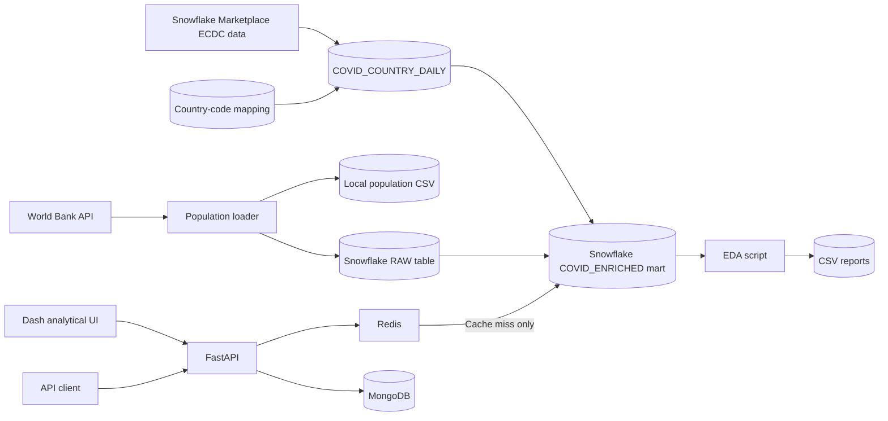

# COVID-19 Analytics Platform

A bootcamp data-engineering project that combines World Bank population data,
Snowflake analytics, a FastAPI service, MongoDB, and Redis. The repository
provides a reproducible development and container environment, Snowflake setup
and transformations, population ingestion, cached analytical APIs, automated
exploratory-data-analysis exports, and a responsive analytical dashboard with
MongoDB annotations.

## Start here: run the project from a new computer

This is the primary setup path. You do not need to read the source code or run
individual SQL files. Follow the sections in order; the guided command validates
each prerequisite before it changes the next system.

### What this project starts

The finished project has four local Docker services and one remote data system:

- **Dash dashboard** at <http://localhost:8050/overview> for overview, country,
  comparison, and annotation pages.
- **FastAPI API** at <http://localhost:8000/docs> for documented HTTP endpoints.
- **Redis** inside Docker for 24-hour analytical response caching. The API fails
  closed if Redis is unavailable so a broken cache cannot create repeated
  Snowflake queries and consume trial credits.
- **MongoDB** at host port `27017` for annotations.
- **Snowflake** in your trial account for Marketplace source data and the
  analytical marts queried by the API.

The terminal is the text-based application used to run commands. On Windows,
use PowerShell; on macOS or Linux, use Terminal. The **repository root** is the
downloaded project folder containing `README.md`, `compose.yaml`, `setup.ps1`,
and `setup.sh`. Run every command below from that folder.

### 1. Create the Snowflake account

Create a Snowflake trial account before installing the local application:

1. Open the [Snowflake trial registration page](https://signup.snowflake.com/).
2. Choose **Amazon Web Services (AWS)** as the cloud provider.
3. Choose the **Europe (Stockholm)** region. Other regions may work, but the
   project onboarding contract and tested example use AWS Stockholm.
4. Finish account creation and sign in to Snowsight.
5. Record these values in a password manager:
   - organization name;
   - account name;
   - Snowflake username;
   - Snowflake password.

The connector needs `SNOWFLAKE_ACCOUNT` in `organization-account` form, for
example `acme-xy12345`. Find this account identifier in Snowsight account
details. Do **not** use the Snowsight browser URL, `https://`, a regional
hostname, or a value ending in `snowflakecomputing.com`.

### 2. Add the required Marketplace database

While signed in to the same Snowflake account:

1. Open **Data Products** / **Marketplace** in Snowsight.
2. Find the free COVID-19 epidemiological data listing that contains ECDC data.
3. Add or get the listing for the current account.
4. Name the installed database exactly:

   ```text
   COVID19_EPIDEMIOLOGICAL_DATA
   ```

5. In a Snowsight worksheet, confirm this object exists and is queryable:

   ```sql
   SELECT *
   FROM COVID19_EPIDEMIOLOGICAL_DATA.PUBLIC.ECDC_GLOBAL
   LIMIT 1;
   ```

Setup deliberately checks both the database and
`COVID19_EPIDEMIOLOGICAL_DATA.PUBLIC.ECDC_GLOBAL`. A similarly named database
or another COVID listing is not interchangeable.

> If setup later says the Marketplace object is missing, return to this step.
> Installing the listing in a different Snowflake account or under a different
> database name is the usual cause.

### 3. Install the only local prerequisite: Docker

The normal setup, start, stop, and application workflow requires **Docker only**.
You do not need to install Python, uv, Java, MongoDB, Redis, Snowflake command-line
tools, or a code editor. Python and uv are installed inside a pinned Docker image.
After setup, you use the application through a web browser.

#### Git or a ZIP download

Git is recommended because it makes updates and branch history available:

- Windows: install [Git for Windows](https://git-scm.com/download/win).
- macOS: run `xcode-select --install`, or install Git with Homebrew.
- Linux: install `git` with your distribution package manager.

Verify it in a new terminal:

```bash
git --version
```

Git is optional if you download and extract the repository ZIP from GitHub.
The guided setup works without a `.git` directory; you simply will not have Git
history or normal pull/update commands.

#### Docker and Docker Compose

- Windows/macOS: install [Docker Desktop](https://www.docker.com/products/docker-desktop/).
- Linux: install Docker Engine and the Docker Compose v2 plugin using the
  [official Docker instructions](https://docs.docker.com/engine/install/).

Start Docker Desktop, or start the Docker service on Linux. Installation alone
is not enough: the engine must be running. Verify the client, server, and
Compose plugin:

```bash
docker --version
docker info
docker compose version
```

`docker info` must show a **Server** section. On Linux, if it reports permission
denied, configure non-root Docker access according to the official Docker
post-install instructions, then open a new login session.

Git remains optional. If you download the repository ZIP, the complete user
workflow needs only Docker Desktop/Engine, the operating system's built-in
terminal, and a browser.

### 4. Download the repository and enter its root

With Git:

```bash
git clone <repository-url>
cd bootcamp-project
```

Without Git, download the repository ZIP, extract it, and open the extracted
`bootcamp-project` folder in a terminal.

Confirm the current folder before setup.

PowerShell:

```powershell
Get-Location
Get-Item README.md, compose.yaml, setup.ps1, setup.sh
```

macOS/Linux:

```bash
pwd
ls README.md compose.yaml setup.ps1 setup.sh
```

If any file is reported missing, change directory into the repository root.
Do not run setup from `Downloads`, your home folder, or the parent GitHub folder.

### 5. Understand the configuration values

The guided setup creates `.env` from `.env.example`, prompts only for missing
secret/account values, backs up an existing `.env`, validates the serialized
file, then replaces it atomically. `.env` is ignored by Git. Do not commit it,
paste it into an issue, or share its contents.

These values control Snowflake:

| Variable | Meaning and expected value |
| --- | --- |
| `SNOWFLAKE_ACCOUNT` | Connector account identifier such as `organization-account`; never a URL or hostname. |
| `SNOWFLAKE_USER` | The Snowflake login created for this account. |
| `SNOWFLAKE_PASSWORD` | Password for that login; hidden during prompting and never written to the audit log. |
| `SNOWFLAKE_BOOTSTRAP_ROLE` | One-time account-level setup role. Keep the default `ACCOUNTADMIN`; it creates the warehouse/project roles and grants them to the user. |
| `SNOWFLAKE_ROLE` | Deployment role, `COVID_PROJECT_ADMIN`; creates schemas, views, tables, and reporting objects after bootstrap. |
| `SNOWFLAKE_API_ROLE` | Runtime least-privilege role, `COVID_APP_ROLE`; FastAPI uses this instead of `ACCOUNTADMIN`. |
| `SNOWFLAKE_WAREHOUSE` | Project warehouse, `COVID_WH`, with auto-suspend/auto-resume and a resource monitor. |
| `SNOWFLAKE_DATABASE` | Project-owned database, `COVID_ANALYTICS`. |
| `SNOWFLAKE_SCHEMA` | Default loader/deployment schema, `RAW`. |
| `SNOWFLAKE_API_SCHEMA` | Default API analytical schema, `MARTS`. |

These values control the local services:

| Variable | Meaning and expected value |
| --- | --- |
| `MONGO_ROOT_USERNAME` | Root username used only for the project-owned MongoDB container. |
| `MONGO_ROOT_PASSWORD` | Local MongoDB root password; leave the guided prompt blank to generate a strong value. |
| `MONGO_DATABASE` | Application database, normally `covid_app`. |
| `MONGODB_URI` | Complete MongoDB connection string. Guided setup derives it from the username/password/database and URL-encodes credentials. |
| `REDIS_URL` | Host-side default `redis://localhost:6379/0`; Compose supplies `redis://redis:6379/0` to the API container. |

The bootstrap role is temporary authority for setup; the project admin role is
for deployment; the API role is for runtime reads. Do not simplify all three to
`ACCOUNTADMIN`. That would defeat the repository's least-privilege design.

### 6. Run the one-time guided setup

Keep Docker running. The first run builds the pinned setup image (including its
private Python/uv environment), downloads a small World Bank dataset, and
creates Snowflake objects, so it normally takes several minutes. Nothing is
installed into your host Python environment.

Windows PowerShell:

```powershell
Set-ExecutionPolicy -Scope Process Bypass
.\setup.ps1
```

The execution-policy change applies only to the current PowerShell process.

macOS/Linux:

```bash
chmod +x setup.sh start.sh stop.sh
./setup.sh
```

The terminal displays **Step X of 9** and performs these operations:

1. Validates the Docker engine/Compose plugin and ports `8000`, `8050`, and
   `27017`, then builds the pinned setup image.
2. Inside the temporary setup container, validates repository permissions and
   secret-ignore rules, creates or backs up `.env`, collects hidden secrets,
   authenticates with the bootstrap role, and checks the Marketplace ECDC object.
3. Creates the resource-monitored `COVID_WH`, project database/schemas, and
   least-privilege roles; grants the project roles to the configured user.
4. Reconnects as the newly granted `COVID_PROJECT_ADMIN`, creates the project
   schemas/API grants, verifies Marketplace access, and deploys mapping/staging.
5. Fetches, validates, and loads World Bank population data transactionally;
   invalid downloads never replace valid published data.
6. Creates and verifies the enriched MARTS and reporting objects.
7. The host launcher validates Compose, builds images, and starts FastAPI, Dash,
   MongoDB, and Redis without mounting the Docker socket into a container.
8. Creates the MongoDB annotations collection/indexes idempotently from the API
   container.
9. Verifies container networking, API readiness, explicit Snowflake access,
   analytical data, and the dashboard, while writing a redacted JSONL audit log.

If a step fails, the terminal shows **SETUP COULD NOT CONTINUE**, what happened,
the likely cause, specific repair actions, the exact retry command, and a
technical reference. Correct the cause and resume safely:

```powershell
.\setup.ps1 --resume
```

or:

```bash
./setup.sh --resume
```

Resume skips a completed step only when its input checksum, setup identity, and
live postcondition still match. Ctrl+C exits with status `130`, flushes the
audit log, and preserves containers, volumes, and resumable state.

### 7. Confirm setup succeeded

A successful run ends with **SETUP COMPLETED SUCCESSFULLY**, the application
URLs, the correct start/stop command for your operating system, and an audit log
path under `outputs/setup/`. That audit is structured JSON and excludes secrets.

Check service state:

```bash
docker compose ps
```

`api`, `dashboard`, `mongo`, and `redis` should be running and healthy.

PowerShell verification:

```powershell
Invoke-RestMethod http://localhost:8000/health/live
Invoke-RestMethod http://localhost:8000/health/ready
Invoke-RestMethod http://localhost:8000/countries
```

macOS/Linux verification:

```bash
curl -i http://localhost:8000/health/live
curl -i http://localhost:8000/health/ready
curl -i http://localhost:8000/countries
```

The two health routes return HTTP `200`; liveness contains `{"status":"ok"}`
and countries returns a non-empty JSON list. The explicit Snowflake check may
resume `COVID_WH`, so call it only when you deliberately want a live check:

```bash
curl -i http://localhost:8000/health/snowflake
```

### 8. Open and use the dashboard

Open <http://localhost:8050/overview>. The navigation contains:

- **Overview**: headline totals, leading countries, and a world map.
- **Country Explorer**: choose one country, metric, and date range.
- **Compare**: select multiple countries and compare normalized trends.
- **Annotations**: create and retrieve country/date notes stored in MongoDB.

The Snowflake status initially says **Not checked**. This is a neutral state,
not a failure: the dashboard deliberately avoids waking the warehouse on page
load. Use **Check Snowflake** only when a live connection test is necessary.
Loading indicators mean a request is in progress. Empty-data messages can be
valid for a selected country/date range; red dependency messages include a
safe retry action and indicate which service needs attention.

### 9. Daily start and stop

After the one-time setup, do not rerun deployment for normal daily use.

Start existing services:

```powershell
.\start.ps1
```

or:

```bash
./start.sh
```

`start` validates Docker and `.env`, starts the existing Compose services, and
waits for their cheap health checks. It does not need Python/uv, redeploy
Snowflake, reload population data, or call the live Snowflake health endpoint.

Stop services safely:

```powershell
.\stop.ps1
```

or:

```bash
./stop.sh
```

`stop` stops containers but preserves MongoDB/Redis volumes and every Snowflake
object. `setup` is one-time deployment, `start` is daily operation, and `stop`
is a non-destructive shutdown.

### 10. Quick recovery guide

- **Docker is installed but setup says its engine is unavailable:** start Docker
  Desktop and wait for it to finish, or start the Linux Docker service; rerun
  `docker info`, then resume setup.
- **Port 8000, 8050, or 27017 is occupied:** the error names the service. On
  Windows inspect it with `Get-NetTCPConnection -LocalPort <port>`; on
  macOS/Linux use `lsof -i :<port>` or `ss -ltnp`. Stop only a process you
  recognize. Setup never kills processes automatically.
- **Snowflake authentication/account failure:** verify sign-in in Snowsight and
  correct the connector-form account, username, or hidden password in `.env`.
- **Marketplace failure:** install the listing in the same account as the
  configured credentials, with the exact database/object names shown above.
- **Role, warehouse, or MARTS failure:** keep the three role settings distinct
  and resume setup so grants and postconditions are rechecked.
- **API returns `503`:** read `error.code` and `request_id` in the response. A
  Redis error intentionally blocks Snowflake queries; restore Redis instead of
  bypassing the protection. See the full troubleshooting section below.
- **Dashboard cannot reach API:** `http://api:8000` is correct inside Compose;
  `http://localhost:8000` is correct from your host browser/terminal.
- **MongoDB credentials changed after first start:** restore the credentials
  that initialized the volume. The destructive reset documented below is only
  for disposable local annotations and is never run by setup.

For individual SQL execution or recovery without the guided workflow, continue
at [Advanced: manual setup and recovery](#advanced-manual-setup-and-recovery).

## Current capabilities

- Creates the Snowflake warehouse, resource monitor, database, and schemas.
- Explores the Snowflake Marketplace COVID-19 dataset and builds staging and
  enriched analytical views.
- Normalizes known country-code mismatches and classifies locations without a
  matching World Bank population record.
- Creates a latest-country reporting snapshot and detects sustained case-growth
  patterns with Snowflake `MATCH_RECOGNIZE`.
- Downloads 2020 country population data from the World Bank API, saves it
  locally, and loads it into Snowflake.
- Runs analytical queries against the included Snowflake mart and exports EDA
  results as CSV files.
- Runs FastAPI, a multi-page Dash interface, MongoDB, and Redis through Compose.
- Exposes cheap liveness/readiness routes and an explicit Snowflake check.
- Serves country, summary, time-series, comparison, and overview data from the
  Snowflake MARTS layer using `COVID_APP_ROLE`.
- Serves combined country and comparison page payloads so charts do not issue
  independent Snowflake-backed requests.
- Caches successful analytical responses in Redis for 24 hours and prevents
  concurrent cache misses from duplicating Snowflake queries.
- Stores canonical country/date annotations in MongoDB with indexed filtering.
- Emits structured JSON logs with request IDs and contains no native Python
  `print()` calls.
- Locks Python dependencies with uv and runs Ruff, isort, and Black locally and
  in GitHub Actions.

Forecasting, clustering, authentication, and user preferences are intentionally
out of scope for this delivery.

## Architecture


```mermaid
flowchart LR
    Market[Snowflake Marketplace ECDC data] --> Staging[(COVID_COUNTRY_DAILY)]
    Mapping[(Country-code mapping)] --> Staging
    WB[World Bank API] --> Loader[Population loader]
    Loader --> CSV[(Local population CSV)]
    Loader --> Raw[(Snowflake RAW table)]
    Staging --> Marts[(Snowflake COVID_ENRICHED mart)]
    Raw --> Marts
    Marts --> EDA[EDA script]
    EDA --> Reports[(CSV reports)]

    Browser[Dash analytical UI] --> API[FastAPI]
    Client[API client] --> API
    API --> Redis
    Redis -->|Cache miss only| Marts
    API --> Mongo[(MongoDB)]
```

## Technology stack

| Area                  | Technology                                     |
| --------------------- | ---------------------------------------------- |
| API                   | FastAPI, Uvicorn                               |
| Web interface         | Plotly Dash and Plotly                         |
| Analytics             | Snowflake SQL, pandas, Snowflake Connector      |
| External data         | World Bank API                                 |
| Operational data      | MongoDB 7.0                                    |
| Cache                 | Redis 7.4                                      |
| Dependency management | uv, `pyproject.toml`, `uv.lock`                |
| Runtime               | Python 3.12.13                                 |
| Containers            | Docker Compose                                 |
| Code quality          | Ruff, isort, Black, pre-commit, GitHub Actions |

## Automated setup command reference

The setup automation creates the project-owned Snowflake objects, refreshes the
population table safely, starts the containers, creates MongoDB indexes, and
checks the finished application. It stops on the first failed postcondition and
can resume without repeating completed work.

Before running it, complete these one-time prerequisites:

1. Create the Snowflake account and add the Marketplace database named
   `COVID19_EPIDEMIOLOGICAL_DATA` as described below.
2. Install Docker Desktop/Engine. Git is optional when using a downloaded ZIP.
3. Clone or extract this repository and open a terminal in its root directory.
4. Start Docker Desktop and wait until its engine is ready.

### First-time setup on Windows

Open PowerShell in the repository and run:

```powershell
.\setup.ps1
```

### First-time setup on macOS, Linux, or Git Bash

```bash
./setup.sh
```

The wrapper verifies Docker, builds the pinned setup image, then starts the
guided setup inside a temporary container. It asks for missing Snowflake
settings without echoing passwords. The generated MongoDB password is random.
Existing `.env` files are backed up before an atomic replacement, and secrets
are never written to the image or audit log. The temporary setup container is
removed automatically.

The Snowflake bootstrap connection intentionally uses `ACCOUNTADMIN` only for
account-level object creation and granting `COVID_PROJECT_ADMIN` and
`COVID_APP_ROLE` to the configured user. All remaining deployment work uses the
least-privilege project role.

If setup stops, read the short terminal error and the referenced JSONL audit
file under `outputs/setup/`. Fix the reported cause, then continue with:

```powershell
.\setup.ps1 --resume
```

or:

```bash
./setup.sh --resume
```

Completed steps are skipped only when their input checksum, setup context, and
live postcondition still match. Interrupting with Ctrl+C leaves containers and
volumes unchanged and exits with status `130`.

For unattended execution, prepare a complete `.env` first and run the same
Docker-only launcher:

```powershell
.\setup.ps1 --resume --non-interactive
```

or:

```bash
./setup.sh --resume --non-interactive
```

The command lists missing variable names but never their values. Useful local
diagnostic commands require Docker only:

```bash
docker info
docker compose config
docker compose ps
```

Rerunning setup with `--resume` authenticates with the bootstrap role, confirms
the Marketplace object, rechecks live postconditions, and performs bounded HTTP
smoke tests. It can resume the Snowflake warehouse and should be run
deliberately on a trial account.

### Daily start and stop

After first-time setup, start the existing services without redeploying data:

```powershell
.\start.ps1
```

or:

```bash
./start.sh
```

Stop services while preserving MongoDB and Redis volumes:

```powershell
.\stop.ps1
```

or:

```bash
./stop.sh
```

The three commands have deliberately different responsibilities:

- `setup` is the one-time initialization. It validates `.env`, creates the
  project-owned Snowflake roles and objects, loads population data, builds the
  containers, creates MongoDB indexes, and verifies the finished system.
- `start` is the normal daily command. It starts existing services without
  recreating Snowflake objects or reloading population data.
- `stop` stops the containers without deleting MongoDB or Redis volumes.

### What success looks like

After `start` completes, run:

```bash
docker compose ps
```

The `api`, `dashboard`, `mongo`, and `redis` services should all be running and
healthy. Verify the cheap checks first:

```bash
curl -i http://localhost:8000/health/live
curl -i http://localhost:8000/health/ready
```

Both should return `200`. The Snowflake check is manual because it may resume
`COVID_WH`:

```bash
curl -i http://localhost:8000/health/snowflake
```

With a completed setup it returns `200`, and `GET /countries` returns a
non-empty JSON list. Open:

- Dashboard overview: <http://localhost:8050/overview>
- Comparison: <http://localhost:8050/compare>
- API documentation: <http://localhost:8000/docs>
- API liveness: <http://localhost:8000/health/live>
- Dependency readiness: <http://localhost:8000/health/ready>
- Explicit Snowflake check: <http://localhost:8000/health/snowflake>

Optional exploration is separate from required setup:

```bash
docker compose exec -T api python -m scripts.bootstrap analyze
```

The command uses Python and uv already installed inside the API image; nothing
is installed on the host.

## Advanced: manual setup and recovery

This section is the detailed fallback when you prefer to execute each operation
yourself. Follow the steps in order.
Do not start Docker before finishing the Snowflake setup, because the analytical
API and dashboard need the Snowflake tables and views created in Steps 7–13.

You will set up four things:

1. A Snowflake trial account and the free COVID-19 Marketplace dataset.
2. The project files on your computer.
3. The Snowflake analytical pipeline and World Bank population data.
4. The Docker services: FastAPI, Dash, MongoDB, and Redis.

### Before you begin

You need:

- A computer with Windows, macOS, or Linux.
- An internet connection.
- An email address for the Snowflake trial account.
- Permission to install applications on the computer.
- Enough free disk space for Docker images and project data.

A **terminal** is a window where you type commands. On Windows, use
**PowerShell**:

1. Select the Windows **Start** button.
2. Type `PowerShell`.
3. Open **Windows PowerShell** or **PowerShell**.

Copy one command block at a time, paste it into the terminal, and press
**Enter**. Wait for the command to finish before continuing.

### Step 1 — Create the Snowflake trial account

1. Open the [Snowflake trial sign-up page](https://signup.snowflake.com/) in a
   web browser.
2. Create a free trial account.
3. When Snowflake asks for the cloud platform and region, choose:

   ```text
   Cloud provider: Amazon Web Services (AWS)
   Region: Europe — Stockholm
   ```

4. Save your Snowflake username and password in a password manager.
5. Sign in to Snowflake. The Snowflake web interface is called **Snowsight**.

After signing in, create a SQL worksheet and run:

```sql
SELECT CURRENT_REGION() AS REGION;
```

The result should identify the AWS Stockholm region, normally:

```text
AWS_EU_NORTH_1
```

Stop here if the account is in a different region. The assignment requires AWS
Stockholm.

### Step 2 — Add the free COVID-19 Marketplace dataset

In Snowsight:

1. Make sure the current role is `ACCOUNTADMIN`.
2. Open **Marketplace** or **Data Products → Marketplace**. The exact menu name
   can vary slightly between Snowsight versions.
3. Search for:

   ```text
   COVID-19 Epidemiological Data
   ```

4. Open the free listing and select **Get**, **Install**, or the equivalent
   access button.
5. Use this exact database name when Snowflake asks for one:

   ```text
   COVID19_EPIDEMIOLOGICAL_DATA
   ```

6. Wait until Snowflake finishes adding the data.

Verify the database in a worksheet:

```sql
SHOW DATABASES LIKE 'COVID19_EPIDEMIOLOGICAL_DATA';

SELECT *
FROM COVID19_EPIDEMIOLOGICAL_DATA.PUBLIC.ECDC_GLOBAL
LIMIT 1;
```

The first result must contain one database named
`COVID19_EPIDEMIOLOGICAL_DATA`; the second must return an ECDC source row.

### Step 3 — Install Git, Docker, and uv

Install these tools:

- [Git](https://git-scm.com/downloads) — downloads the project from GitHub.
- [Docker Desktop](https://www.docker.com/products/docker-desktop/) — runs the
  API, dashboard, MongoDB, and Redis.
- [uv](https://docs.astral.sh/uv/getting-started/installation/) — installs the
  pinned Python version and the exact dependencies from `uv.lock`.

#### Windows

Install Git and Docker Desktop using their installers. Keep the default options.
When Docker asks about a backend, use the recommended WSL 2 option. Restart the
computer if an installer asks you to do so.

Install uv by opening PowerShell and running:

```powershell
powershell -ExecutionPolicy ByPass -c "irm https://astral.sh/uv/install.ps1 | iex"
```

Close PowerShell and open it again after the installation.

#### macOS or Linux

Install Git and Docker using the official instructions for your operating
system. Install uv with:

```bash
curl -LsSf https://astral.sh/uv/install.sh | sh
```

Close the terminal and open it again after the installation.

#### Verify the installations

Start Docker Desktop and wait until it reports that Docker is running. Then run:

```bash
git --version
docker --version
docker compose version
uv --version
```

Each command must print a version number. Do not continue while one of these
commands reports that it is unknown, missing, or unable to connect.

### Step 4 — Download the project from GitHub

Open the project repository on GitHub, select **Code**, select **HTTPS**, and
copy the repository URL.

In PowerShell, macOS Terminal, or a Linux terminal, move to a place where you
want to keep the project. For example:

```bash
cd ~/Documents
```

Clone the repository. Replace `PASTE_REPOSITORY_URL_HERE` with the URL copied
from GitHub:

```bash
git clone PASTE_REPOSITORY_URL_HERE
```

Enter the downloaded project directory. If GitHub created a folder with a
different name, use that folder name instead:

```bash
cd bootcamp-project
```

Confirm that you are in the correct directory:

```bash
ls
```

On Windows PowerShell, `dir` can be used instead:

```powershell
dir
```

You should see at least:

```text
README.md
compose.yaml
pyproject.toml
uv.lock
sql
scripts
app
```

All remaining terminal commands must be run from this project directory unless
a step explicitly says otherwise.

> If you received the project as a ZIP file instead of cloning it, extract the
> ZIP, open a terminal in the extracted folder, and confirm that `compose.yaml`
> is visible before continuing.

### Step 5 — Install the locked Python environment

Run:

```bash
uv sync --locked
```

uv reads `.python-version`, installs the pinned Python version when necessary,
creates the isolated `.venv` directory, and installs the exact dependency
versions recorded in `uv.lock`.

Verify the environment:

```bash
uv run python --version
```

The result should show Python `3.12.13` for the current project version.

You do not need to activate `.venv`. Commands beginning with `uv run` use the
isolated project environment automatically.

### Step 6 — Learn how to run the Snowflake SQL files

The SQL files are in the local `sql/` folder, but they must be executed in the
Snowflake website. **Do not paste Snowflake SQL into PowerShell or another
computer terminal.**

For every SQL file in the following steps:

1. Open the file on your computer in a text editor such as Visual Studio Code,
   Notepad, or another plain-text editor.
2. Select all text and copy it.
3. In Snowsight, open **Projects → Workspaces** or a new SQL worksheet.
4. Paste the copied SQL into the worksheet.
5. Confirm that the role shown at the top matches the role required by the
   step.
6. Execute all statements in the file. If the interface executes only the
   statement containing the cursor, highlight the complete file before
   selecting **Run**.
7. Read the result messages. Do not continue past a red error message.

The file numbers define the required execution order.

### Step 7 — Create the Snowflake account objects, grant roles, and create schemas

In Snowsight, select the `ACCOUNTADMIN` role and run:

```text
sql/00_project_setup.sql
```

This first phase creates:

```text
COVID_PROJECT_MONITOR
COVID_WH
COVID_ANALYTICS
COVID_PROJECT_ADMIN
COVID_APP_ROLE
```

The final result also includes `PYTHON_ACCOUNT_IDENTIFIER`. Copy that value; it
will look similar to:

```text
MYORGANIZATION-MYACCOUNT
```

Do not use only the short account locator.

Before running any SQL that says `USE ROLE COVID_PROJECT_ADMIN`, grant both
roles to your deployment user. Run this as `ACCOUNTADMIN`, replacing the
placeholder with the value returned by `SELECT CURRENT_USER()`:

```sql
GRANT ROLE COVID_PROJECT_ADMIN TO USER YOUR_SNOWFLAKE_USERNAME;
GRANT ROLE COVID_APP_ROLE TO USER YOUR_SNOWFLAKE_USERNAME;
```

Then run the second phase:

```text
sql/00_project_objects.sql
```

This ordering is required. Creating a role does not by itself authorize the
current user to activate it. The automated Docker setup performs the two bound
user grants between these SQL files and reconnects explicitly with
`COVID_PROJECT_ADMIN` before executing the second phase.

The second phase creates:

```text
COVID_ANALYTICS.RAW
COVID_ANALYTICS.STAGING
COVID_ANALYTICS.MARTS
COVID_ANALYTICS.APP
```

### Step 8 — Explore the source and create the staging layer

Run these files in this exact order:

```text
sql/01_data_exploration.sql
sql/02_create_country_mapping.sql
sql/03_create_staging_view.sql
```

Use `COVID_PROJECT_ADMIN` unless the SQL file explicitly changes the role.

After Step 8, verify the staging view:

```sql
SELECT COUNT(*) AS ROW_COUNT
FROM COVID_ANALYTICS.STAGING.COVID_COUNTRY_DAILY;
```

The query should return a positive row count, not zero.

### Step 9 — Create the local `.env` configuration file

The project includes `.env.example`, which lists every required setting. Copy it
to a new file named `.env`.

Windows PowerShell:

```powershell
Copy-Item .env.example .env
notepad .env
```

macOS or Linux:

```bash
cp .env.example .env
nano .env
```

When using `nano`, save with **Ctrl+O**, press **Enter**, and exit with
**Ctrl+X**. You can also open `.env` in any other plain-text editor.

Replace the placeholder values with your own values. The important section must
look like this:

```dotenv
SNOWFLAKE_ACCOUNT=MYORGANIZATION-MYACCOUNT
SNOWFLAKE_USER=YOUR_SNOWFLAKE_USERNAME
SNOWFLAKE_PASSWORD=YOUR_SNOWFLAKE_PASSWORD
SNOWFLAKE_ROLE=COVID_PROJECT_ADMIN
SNOWFLAKE_API_ROLE=COVID_APP_ROLE
SNOWFLAKE_WAREHOUSE=COVID_WH
SNOWFLAKE_DATABASE=COVID_ANALYTICS
SNOWFLAKE_SCHEMA=RAW
SNOWFLAKE_API_SCHEMA=MARTS

MONGO_ROOT_USERNAME=covid_admin
MONGO_ROOT_PASSWORD=ChooseANewPassword123
MONGO_DATABASE=covid_app
```

Replace:

- `MYORGANIZATION-MYACCOUNT` with the `PYTHON_ACCOUNT_IDENTIFIER` copied in
  Step 7.
- `YOUR_SNOWFLAKE_USERNAME` with your Snowflake username.
- `YOUR_SNOWFLAKE_PASSWORD` with your Snowflake password.
- `ChooseANewPassword123` with a new local MongoDB password.

Use only letters and numbers in the MongoDB password for the beginner setup.
This avoids URL-encoding problems.

Save and close `.env`.

> **Security:** `.env` contains passwords. Never upload it, email it, paste it
> into screenshots, or commit it to Git. The repository is configured to ignore
> it.

### Step 10 — Load the World Bank population data

From the project directory in the terminal, run:

```bash
uv run python scripts/load_population.py
```

A successful run should report that it downloaded and loaded approximately 217
rows. The exact wording may differ because the application uses structured JSON
logging.

If the command reports `404 Not Found` for a Snowflake login request, check
`SNOWFLAKE_ACCOUNT`. It must be the full `organization-account` identifier from
Step 7.

### Step 11 — Verify the population data

In Snowsight, run:

```text
sql/04_verify_population_data.sql
```

Then run this direct check:

```sql
SELECT COUNT(*) AS POPULATION_ROWS
FROM COVID_ANALYTICS.RAW.WORLD_BANK_POPULATION_2020;
```

The current source normally produces 217 rows.

### Step 12 — Create the enriched analytical mart

In Snowsight, run:

```text
sql/05_create_enriched_view.sql
```

Verify it:

```sql
SELECT COUNT(*) AS MART_ROWS
FROM COVID_ANALYTICS.MARTS.COVID_ENRICHED;
```

The result must be greater than zero.

### Step 13 — Create the reporting objects and run final SQL checks

In Snowsight, run:

```text
sql/06_create_reporting_objects.sql
sql/07_analysis_queries.sql
```

Verify the API reporting snapshot:

```sql
SELECT COUNT(*) AS COUNTRY_COUNT
FROM COVID_ANALYTICS.MARTS.COUNTRY_LATEST_METRICS;
```

The result must be greater than zero.

Optionally generate the local EDA CSV files:

```bash
uv run python scripts/run_eda.py
```

The files will be created under:

```text
outputs/eda/
```

At this point, the Snowflake data pipeline is ready.

### Step 14 — Start Docker Desktop

Open Docker Desktop and wait until it says that the Docker engine is running.
Test it from the project directory:

```bash
docker version
```

The output must include both a **Client** section and a **Server** section.

### Step 15 — Build and start the application services

Run:

```bash
docker compose up --build -d
```

The first build can take several minutes. Docker downloads the required images,
builds the project image, and starts:

```text
api
dashboard
mongo
redis
```

Check the status:

```bash
docker compose ps
```

Wait until the services show as running or healthy. If one fails, inspect the
logs:

```bash
docker compose logs api dashboard mongo redis
```

### Step 16 — Create the MongoDB annotation collection and indexes

Run:

```bash
docker compose exec api python -m scripts.setup_mongodb
```

This command is safe to run more than once. It creates the `annotations`
collection when needed and creates the indexes used by the annotation API.

### Step 17 — Verify the complete application

Open these addresses in a web browser, in this order:

1. <http://localhost:8000/health/live> — the API process should return
   `{"status":"ok"}`.
2. <http://localhost:8000/health/ready> — MongoDB and Redis should be ready.
3. <http://localhost:8000/health/snowflake> — Snowflake and the required MARTS
   objects should be accessible.
4. <http://localhost:8000/docs> — interactive FastAPI documentation.
5. <http://localhost:8050/overview> — global dashboard.
6. <http://localhost:8050/country> — Country Explorer.
7. <http://localhost:8050/compare> — country comparison.
8. <http://localhost:8050/annotations> — MongoDB annotations.

The Snowflake check is explicit because it can resume `COVID_WH` and consume
trial credits. The dashboard does not repeatedly poll Snowflake in the
background.

To verify caching, open or request the overview twice. The first successful
response should contain:

```text
X-Cache: MISS
```

The second identical response should contain:

```text
X-Cache: HIT
```

You can inspect these headers in Swagger at <http://localhost:8000/docs> or from
a terminal. On Windows PowerShell, run:

```powershell
curl.exe -i http://localhost:8000/dashboard/overview
curl.exe -i http://localhost:8000/dashboard/overview
```

On macOS or Linux, run:

```bash
curl -i http://localhost:8000/dashboard/overview
curl -i http://localhost:8000/dashboard/overview
```

### Step 18 — Stop and restart the project

Stop the application without deleting MongoDB or Redis data:

```bash
docker compose down
```

Start it again later:

```bash
docker compose up -d
```

Do **not** use the following command unless you intentionally want to delete all
local MongoDB annotations and Redis data:

```bash
docker compose down -v
```

### Blank-slate completion checklist

The setup is complete only when every item below is true:

- [ ] Snowflake is in AWS Stockholm.
- [ ] `COVID19_EPIDEMIOLOGICAL_DATA` exists.
- [ ] `COVID_WH` and `COVID_PROJECT_MONITOR` exist.
- [ ] `COVID_ANALYTICS.STAGING.COVID_COUNTRY_DAILY` contains rows.
- [ ] `COVID_ANALYTICS.RAW.WORLD_BANK_POPULATION_2020` contains population rows.
- [ ] `COVID_ANALYTICS.MARTS.COVID_ENRICHED` contains rows.
- [ ] `COVID_ANALYTICS.MARTS.COUNTRY_LATEST_METRICS` contains rows.
- [ ] `docker compose ps` shows the four application services running.
- [ ] `/health/live`, `/health/ready`, and `/health/snowflake` succeed.
- [ ] The Overview, Country Explorer, Comparison, and Annotations pages open.
- [ ] Two identical overview requests produce `MISS` followed by `HIT`.

### Docker services

| Service | Container | Address | Purpose |
| ------- | --------- | ------- | ------- |
| `api` | `covid_api` | <http://localhost:8000> | FastAPI application |
| `dashboard` | `covid_dashboard` | <http://localhost:8050> | Dash analytical UI |
| `mongo` | `covid_mongo` | `127.0.0.1:27017` | Annotation data store |
| `redis` | `covid_redis` | Internal Docker network only | API cache |

Useful commands:

```bash
docker compose ps
docker compose logs -f api
docker compose logs -f dashboard
docker compose restart api
docker compose restart dashboard
docker compose exec api python --version
```

## API endpoints

| Method | Path                              | Description                                      |
| ------ | --------------------------------- | ------------------------------------------------ |
| `GET`  | `/health`, `/health/live`         | Process liveness; no dependency calls            |
| `GET`  | `/health/ready`                   | MongoDB and Redis readiness                       |
| `GET`  | `/health/snowflake`               | Explicit uncached Snowflake and MARTS check       |
| `GET`  | `/dashboard/overview`             | Latest global and per-location analytical values |
| `GET`  | `/dashboard/countries/{identifier}` | Combined Country Explorer payload               |
| `GET`  | `/dashboard/compare`              | Combined three-metric comparison payload          |
| `GET`  | `/countries`                      | Canonical country and ISO identities              |
| `GET`  | `/countries/{identifier}/summary` | Latest stored country metrics                     |
| `GET`  | `/countries/{identifier}/timeseries` | Filtered metric points                         |
| `GET`  | `/compare`                        | Two-to-ten-country metric comparison              |
| `POST` | `/annotations`                    | Validate and create a MongoDB annotation           |
| `GET`  | `/annotations`                    | Filter chronological MongoDB annotations           |
| `GET`  | `/docs`                           | Swagger UI                                        |

Analytical responses include `X-Cache: MISS`, `HIT`, or `BYPASS`. Redis is a
budget-protection dependency: if Redis is unavailable while caching is enabled,
analytical routes return `503` without opening a Snowflake connection.

Example acceptance requests:

```bash
curl -i http://localhost:8000/health/live
curl -i http://localhost:8000/health/ready
curl -i http://localhost:8000/health/snowflake
curl -i http://localhost:8000/dashboard/overview
curl -i http://localhost:8000/dashboard/overview
curl -i "http://localhost:8000/dashboard/countries/LV?metric=cases_per_100k&start_date=2020-03-01&end_date=2020-12-14"
curl -i "http://localhost:8000/dashboard/compare?country=LV&country=EE&start_date=2020-03-01&end_date=2020-12-14"
curl -i http://localhost:8000/countries/LV/summary
curl -i "http://localhost:8000/compare?country=LV&country=EE&metric=cases_per_100k&start_date=2020-03-01&end_date=2020-12-14"
```

The first overview call should be `MISS`; the second should be `HIT` and should
not query Snowflake.

### Cache invalidation and query budget

Successful analytical responses are cached for 24 hours. Change
`CACHE_NAMESPACE` when a deployment changes response semantics, or clear only
the current project prefix after refreshing the marts:

```bash
docker compose exec api python -m scripts.clear_cache
```

The script uses incremental Redis `SCAN` calls and never flushes unrelated
Redis data. Redis failures are fail-closed by design: spending Snowflake credits
is not used as an automatic cache fallback.

The Country Explorer loads its complete page response once into:

```python
dcc.Store(id="country-page-data", storage_type="memory")
```

KPI and chart callbacks consume that stored JSON and never make independent API
calls. The comparison and overview pages use the same page-level pattern. The
country catalog and Snowflake status use session stores because they are small
and reused across navigation.

### Annotation workflow

Create or verify the MongoDB indexes:

```bash
docker compose exec api python -m scripts.setup_mongodb
```

Create an annotation through Swagger or curl:

```bash
curl -i -X POST http://localhost:8000/annotations \
  -H "Content-Type: application/json" \
  -d '{"country":"LV","report_date":"2020-03-15","metric":"new_cases","comment":"Reporting delay.","created_by":"Student"}'
```

Read it back:

```bash
curl -i "http://localhost:8000/annotations?country=LV&metric=new_cases&start_date=2020-03-01&end_date=2020-03-31"
```

Creation validates that the country and report date exist in the Snowflake
mart. Successful validation is cached for 24 hours. Annotation lists are read
directly from MongoDB and are never response-cached.

## Local development

This section is optional and intended only for contributors who want to run or
modify Python code outside Docker. Normal dashboard users should stop at the
Docker-only setup above and do not need Python or uv on the host.

This optional workflow requires
[uv](https://docs.astral.sh/uv/getting-started/installation/). uv reads
`.python-version` and can install the project's pinned Python version
automatically.

Install the locked runtime and development dependencies:

```bash
uv sync --locked
uv run python --version
```

Run the API locally only when MongoDB and Redis are available and
`MONGODB_URI` and `REDIS_URL` are set in the shell:

```bash
uv run uvicorn app.main:app --reload
```

The Docker workflow is recommended for API development because Compose creates
those connection strings automatically.

### Dependency management

`pyproject.toml` is the source of declared dependencies. `uv.lock` records the
resolved versions used across environments.

```bash
uv add package-name
uv add --dev development-package
uv lock --check
uv sync --locked
```

Commit both `pyproject.toml` and `uv.lock` whenever dependencies change. Do not
edit `uv.lock` manually.

## Configuration

Copy `.env.example` to `.env` and configure these values:

| Variable              | Required by       | Description                                                     |
| --------------------- | ----------------- | --------------------------------------------------------------- |
| `SNOWFLAKE_ACCOUNT`   | Snowflake scripts | Organization-account identifier returned by the setup SQL       |
| `SNOWFLAKE_USER`      | Snowflake scripts | Snowflake username                                              |
| `SNOWFLAKE_PASSWORD`  | Snowflake scripts | Snowflake password                                              |
| `SNOWFLAKE_ROLE`      | Snowflake scripts | Project role; defaults to `COVID_PROJECT_ADMIN` in code         |
| `SNOWFLAKE_API_ROLE`  | FastAPI            | Least-privilege runtime role; use `COVID_APP_ROLE`              |
| `SNOWFLAKE_WAREHOUSE` | Snowflake scripts | Compute warehouse                                               |
| `SNOWFLAKE_DATABASE`  | Population loader | Connection database; use `COVID_ANALYTICS` with the current SQL |
| `SNOWFLAKE_SCHEMA`    | Population loader | Connection schema; use `RAW` with the current SQL               |
| `SNOWFLAKE_API_SCHEMA` | FastAPI           | Analytical schema; use `MARTS`                                  |
| `MONGO_ROOT_USERNAME` | Docker Compose     | MongoDB root username                                           |
| `MONGO_ROOT_PASSWORD` | Docker Compose     | MongoDB root password                                           |
| `MONGO_DATABASE`      | Docker Compose     | Application database name                                       |
| `MONGODB_URI`         | Local FastAPI      | Local MongoDB connection URI                                    |
| `REDIS_URL`           | API/cache scripts  | Redis connection URI                                            |
| `CACHE_NAMESPACE`     | FastAPI            | Versioned prefix; current default is `covid-api:v2`              |
| `CACHE_TTL_*`         | FastAPI            | Endpoint cache durations; defaults are 86400 seconds            |
| `DASHBOARD_API_BASE_URL` | Dash             | FastAPI base URL used by the status interface                   |
| `DASHBOARD_PUBLIC_API_BASE_URL` | Browser      | Host-visible FastAPI URL used by the Swagger link               |

Compose overrides `MONGODB_URI`, `REDIS_URL`, and the dashboard API URL for
container networking. Never commit `.env`; it is excluded by `.gitignore` and
`.dockerignore`.

## Snowflake pipeline reference

This section explains the Snowflake pipeline in more technical detail. If you
already completed Steps 7–13 in **Run the complete project from a blank
computer**, the required objects already exist and you do not need to repeat
these steps unless you are rebuilding or troubleshooting the pipeline.

The pipeline is optional for process-only API health endpoints, but it is
required for the analytical API and dashboard. You need:

- Access to a Snowflake account
- Permission to use `ACCOUNTADMIN` for the initial setup, or help from a
  Snowflake administrator; later steps use `COVID_PROJECT_ADMIN`
- The free Marketplace data installed as
  `COVID19_EPIDEMIOLOGICAL_DATA`
- [uv](https://docs.astral.sh/uv/getting-started/installation/) for the Python
  population loader and EDA script

The SQL files are designed for Snowsight. Open each file in a SQL worksheet,
place the cursor inside one statement, and select **Run**. Run statements one
at a time so that errors and results are easy to inspect.

### 1. Create the Snowflake project objects

Run [`sql/00_project_setup.sql`](sql/00_project_setup.sql) as `ACCOUNTADMIN`.
It creates:

- A five-credit monthly resource monitor named `COVID_PROJECT_MONITOR`
- An `XSMALL` warehouse named `COVID_WH`
- The `COVID_ANALYTICS` database
- A least-privilege project role named `COVID_PROJECT_ADMIN`
- A read-only API runtime role named `COVID_APP_ROLE`
- Imported access from the Marketplace database to `COVID_PROJECT_ADMIN`

The monitor notifies at 50%, suspends the warehouse at 80%, and suspends it
immediately at 100%. Confirm that this quota is appropriate for your account
before running the file. The final query returns the
`PYTHON_ACCOUNT_IDENTIFIER` needed for `.env`; use that
`organization-account` value, not only the account locator.

The setup grants the project role to `SYSADMIN`, but the deployment user must
still receive both project roles before activating them. As `ACCOUNTADMIN`, run
the following after replacing the username:

```sql
GRANT ROLE COVID_PROJECT_ADMIN TO USER YOUR_SNOWFLAKE_USERNAME;
GRANT ROLE COVID_APP_ROLE TO USER YOUR_SNOWFLAKE_USERNAME;
```

Only after both grants succeed, run
[`sql/00_project_objects.sql`](sql/00_project_objects.sql). It activates
`COVID_PROJECT_ADMIN`, creates `RAW`, `STAGING`, `MARTS`, and `APP`, and grants
the MARTS read contract to `COVID_APP_ROLE`.

The automated bootstrap performs this exact boundary with bound user
identifiers: account SQL, user grants, a new project-role connection, and then
project-object SQL. It never executes `USE ROLE COVID_PROJECT_ADMIN` before the
user grant exists. Marketplace access uses Snowflake's shared-database command,
`GRANT IMPORTED PRIVILEGES`, rather than attempting to grant `USAGE` or `SELECT`
on provider-owned objects.

FastAPI connects only as `COVID_APP_ROLE`. That role can use `COVID_WH` and
read current and future MARTS tables/views, but it cannot create or replace
project objects.

### 2. Explore and validate the Marketplace data

Run [`sql/01_data_exploration.sql`](sql/01_data_exploration.sql). It verifies
the `ECDC_GLOBAL` columns, previews the source, checks coverage, duplicates,
missing values, and negative corrections, and confirms that `CASES` and
`DEATHS` are daily rather than cumulative values.

If Snowflake reports that `COVID19_EPIDEMIOLOGICAL_DATA` does not exist, add
the free COVID-19 epidemiological dataset from Snowflake Marketplace and make
it available under that exact database name.

### 3. Create the country mapping

Run
[`sql/02_create_country_mapping.sql`](sql/02_create_country_mapping.sql). It
creates and seeds an idempotent mapping table for source naming/code exceptions
such as `EL` to `GR`, `UK` to `GB`, and the missing Namibia code. It also marks
territories and non-country rows that are not expected to match the current
World Bank extract.

### 4. Create and verify the staging view

Run [`sql/03_create_staging_view.sql`](sql/03_create_staging_view.sql). It
creates `COVID_ANALYTICS.STAGING.COVID_COUNTRY_DAILY`, applies the country
mapping, separates ISO-2 and ISO-3 codes, aggregates duplicate country-date
rows, preserves negative source corrections, and calculates cumulative cases
and deaths from the daily values.

### 5. Configure the Python connection

Copy `.env.example` to `.env`, then replace the Snowflake placeholders. The
project defaults are:

```dotenv
SNOWFLAKE_ACCOUNT=organization-account-from-step-1
SNOWFLAKE_USER=your_username
SNOWFLAKE_PASSWORD=your_password
SNOWFLAKE_ROLE=COVID_PROJECT_ADMIN
SNOWFLAKE_WAREHOUSE=COVID_WH
SNOWFLAKE_DATABASE=COVID_ANALYTICS
SNOWFLAKE_SCHEMA=RAW
```

Install the locked dependencies:

```bash
uv sync --locked
```

### 6. Load and verify the World Bank population data

Run the loader from the repository root:

```bash
uv run python scripts/load_population.py
```

It recreates `COVID_ANALYTICS.RAW.WORLD_BANK_POPULATION_2020` and currently
loads 217 rows. Then run
[`sql/04_verify_population_data.sql`](sql/04_verify_population_data.sql) to
check the row count, missing values, and duplicate country codes.

### 7. Create and verify the enriched mart

Run [`sql/05_create_enriched_view.sql`](sql/05_create_enriched_view.sql). It
joins the daily COVID-19 view to population data and creates
`COVID_ANALYTICS.MARTS.COVID_ENRICHED` with cumulative, daily, per-100,000, and
mortality metrics. Its `POPULATION_JOIN_STATUS` distinguishes matched rows,
expected source-unavailable locations, missing codes, and genuine unmatched
records.

### 8. Create reporting objects and run the analyses

Run
[`sql/06_create_reporting_objects.sql`](sql/06_create_reporting_objects.sql)
to build the small `COUNTRY_LATEST_METRICS` transient snapshot and the
`CASE_INCREASE_PATTERNS` view. Re-run this file after refreshing upstream data
so the transient snapshot stays current.

Then run [`sql/07_analysis_queries.sql`](sql/07_analysis_queries.sql) for
per-capita rankings, mortality rankings, the Baltic-country comparison, and
the longest detected runs of daily case increases.

Export the automated EDA reports locally with:

```bash
uv run python scripts/run_eda.py
```

The complete Snowflake object flow is:

```text
COVID19_EPIDEMIOLOGICAL_DATA.PUBLIC.ECDC_GLOBAL
    + COVID_ANALYTICS.RAW.COUNTRY_CODE_MAPPING
    -> COVID_ANALYTICS.STAGING.COVID_COUNTRY_DAILY

World Bank API
    -> COVID_ANALYTICS.RAW.WORLD_BANK_POPULATION_2020

COVID_ANALYTICS.STAGING.COVID_COUNTRY_DAILY
    + COVID_ANALYTICS.RAW.WORLD_BANK_POPULATION_2020
    -> COVID_ANALYTICS.MARTS.COVID_ENRICHED
    -> COVID_ANALYTICS.MARTS.COUNTRY_LATEST_METRICS

COVID_ANALYTICS.STAGING.COVID_COUNTRY_DAILY
    -> COVID_ANALYTICS.MARTS.CASE_INCREASE_PATTERNS
```

## Population ingestion

The population loader requests country metadata and the `SP.POP.TOTL`
indicator for 2020 from the World Bank. It writes
`data/external/world_bank_population_2020.csv` and loads the same rows into
`COVID_ANALYTICS.RAW.WORLD_BANK_POPULATION_2020`.

After completing the Snowflake setup and configuring `.env`, run:

```bash
uv run python scripts/load_population.py
```

The configured warehouse, `COVID_ANALYTICS` database, and `RAW` schema must
already exist. The selected Snowflake role needs permission to use them and to
create and write tables in the schema. Verify the load with
`sql/04_verify_population_data.sql`.

The checked-in CSV currently contains 217 country records with ISO-2, ISO-3,
country name, population, and population year fields.

> **Important:** the loader executes `CREATE OR REPLACE TABLE`, so running it
> replaces the existing `WORLD_BANK_POPULATION_2020` table.

## Exploratory data analysis

The EDA script expects this object to exist before it runs:

```text
COVID_ANALYTICS.MARTS.COVID_ENRICHED
```

Create the mart by running `sql/05_create_enriched_view.sql` after the staging
view and population table are ready. It provides the country, report date,
population, cumulative cases/deaths, per-100,000 metrics, mortality rate, and
negative-correction flags used by `scripts/run_eda.py`.

Run the reports with:

```bash
uv run python scripts/run_eda.py
```

Results are written to the ignored `outputs/eda/` directory:

- `dataset_coverage.csv`
- `missing_population.csv`
- `data_corrections.csv`
- `latest_country_metrics.csv`

## PySpark Bronze and profiling demonstration

Spark is isolated from the production API. At the current approximately
61,900-row scale, pandas or Snowflake SQL are simpler and cheaper; this path
demonstrates explicit schemas, immutable Bronze storage, quality rules,
broadcast joins, physical-plan inspection, and measured layout decisions.

The pinned runtime is Python 3.12.13, PySpark 3.5.6, Java 17.0.19, and uv
0.11.29. Normal API containers do not contain Java or PySpark. The optional
Spark service runs one local application with two execution threads through
`local[2]`.

### 1. Export one reusable source batch

Complete the Snowflake setup, load population data, and configure `.env` for
the project-admin role. Then run:

```bash
uv run python scripts/export_spark_sources.py \
  --source-batch-id ecdc-2020-v1
```

This is the only Spark workflow step that contacts Snowflake. It opens one
connection, executes two required-column statements, copies the local
population snapshot, and writes `data/source/ecdc-2020-v1/`. Its manifest
contains row counts, byte counts, and SHA-256 checksums. Existing batch IDs are
never overwritten.

### 2. Build and run the pinned Spark container

```bash
docker compose --profile spark build spark

docker compose --profile spark run --rm spark ingest-profile \
  --source-batch-id ecdc-2020-v1 \
  --ingestion-id bronze-v1 \
  --benchmark-run-id benchmark-v1
```

The job validates exact headers, applies explicit schemas, preserves all input
and corrupt records in immutable Bronze Parquet, profiles each source,
aggregates duplicate normalized country/date rows, applies null-safe mappings,
and broadcast-joins typed population keys such as `ISO2:LV`.

Bronze is written to `data/bronze/ingestion_id=bronze-v1/`; successful curated
output is written to `data/curated/ingestion_id=bronze-v1/`; local quality,
event-log, plan, and benchmark artifacts go to `outputs/spark/benchmark-v1/`.
Both the ingestion and benchmark IDs are immutable, so choose unused IDs when
repeating the commands.

The `bronze-quality-v1` rules have deterministic publication behavior:

- Schema drift, corrupt input, missing required values, invalid ISO lengths,
  duplicate mapping/population keys, and non-positive population are failures.
- Null daily measures, duplicate normalized dates, and recoverable missing ISO
  values are warnings.
- Negative cases and deaths are informational corrections and remain unchanged.

Schema failures publish only quality evidence. Other failures publish Bronze
and quarantine evidence but block curated output. Warnings permit curated
publication. Bronze manifest version 2 stores the ruleset, quality status, and
quality-document checksum, allowing later benchmarks to run without retaining
the original benchmark output directory.

### 3. Repeat benchmarks without rewriting Bronze

```bash
docker compose --profile spark run --rm spark benchmark \
  --ingestion-id bronze-v1 \
  --benchmark-run-id benchmark-v2
```

Each comparison performs one warm-up and five measured repetitions in one JVM,
alternating variant order. Results include individual durations, median, range,
input and shuffle bytes, partitions, and output file counts. Before timing, both
variants must pass an exact correctness gate covering ordered schema, row count,
and an order-independent SHA-256 row-multiset checksum. Correctness work is not
included in benchmark durations.

If a gate fails, the run exits nonzero and writes a sanitized
`correctness_failure.json` inside that run's output directory. Warm-up and
measured actions are skipped, and the committed evidence file is unchanged.
Benchmark-only mode requires Bronze manifest version 2; legacy version 1
ingestions must be recreated from their local immutable source batch.

Final file count is derived from measured Parquet bytes with a 128 MiB target.
Year/month directories are used only when monthly partitions are sufficiently
large and bounded in cardinality. This dataset should remain unpartitioned and
coalesce to one file.

Only a completely passing suite atomically publishes
`reports/spark/evidence.json`. Evidence version 2 records the fingerprint
protocol and a passing correctness block for all five comparisons. Raw Marketplace extracts,
Parquet data, event logs, complete plans, and scratch output remain ignored.
The summary contains source and plan hashes without credentials, account names,
SQL, raw rows, or local paths.

Run the Spark fixture suite with:

```bash
uv sync --locked --group spark
uv run --group spark python -m unittest discover -s spark_tests -v
```

## Code quality and CI

Install the Git hook once:

```bash
uv run pre-commit install
```

Run every quality check manually:

```bash
uv run pre-commit run --all-files
```

Individual CI-equivalent commands are:

```bash
uv run isort --check-only --diff .
uv run black --check --diff .
uv run ruff check .
uv run python -m unittest discover -s tests -v
```

The GitHub Actions workflow runs the locked Python environment and all three
checks on every push and pull request.

## Repository structure

```text
.
|-- app/
|   |-- api/                            # Health, analytical, annotation routes
|   |-- dashboard/                      # Multi-page Dash interface
|   |-- models/                         # Pydantic response contracts
|   |-- repositories/                   # Snowflake and MongoDB access
|   |-- services/                       # Cache, analytics, annotations
|   |-- spark_pipeline/                 # Bronze, profiling, transformations
|   |-- config.py                       # Typed environment settings
|   |-- logging_config.py               # Structured JSON logging
|   `-- main.py                         # FastAPI factory and lifespan
|-- data/external/
|   `-- world_bank_population_2020.csv  # Population snapshot
|-- scripts/
|   |-- clear_cache.py                   # Prefix-scoped Redis invalidation
|   |-- export_spark_sources.py          # Snowflake -> immutable local batch
|   |-- load_population.py              # World Bank -> CSV/Snowflake
|   |-- run_eda.py                       # Snowflake mart -> CSV reports
|   |-- run_spark_bronze.py              # Spark ingest/profile/benchmark CLI
|   `-- setup_mongodb.py                 # Annotation collection and indexes
|-- sql/
|   |-- 00_project_setup.sql             # Account objects and project roles
|   |-- 00_project_objects.sql           # Schemas after user role grants
|   |-- 01_data_exploration.sql          # Marketplace source checks
|   |-- 02_create_country_mapping.sql    # Normalize country/code exceptions
|   |-- 03_create_staging_view.sql       # Clean daily and cumulative metrics
|   |-- 04_verify_population_data.sql    # Population load checks
|   |-- 05_create_enriched_view.sql      # Population-enriched analytics mart
|   |-- 06_create_reporting_objects.sql  # Latest snapshot and pattern view
|   `-- 07_analysis_queries.sql          # Final analytical queries
|-- .env.example                        # Configuration template
|-- .pre-commit-config.yaml             # Local Git hooks
|-- .python-version                     # Exact local/CI Python pin
|-- tests/                              # Focused API, cache, repository tests
|-- compose.yaml                         # API, dashboard, MongoDB, Redis
|-- compose.setup.yaml                   # Temporary Docker-only setup runner
|-- dockerfile                          # API image
|-- dockerfile.spark                    # Pinned Java/PySpark image
|-- pyproject.toml                       # Project metadata and dependencies
`-- uv.lock                              # Resolved dependency lockfile
```

## Troubleshooting

### Docker cannot connect to the daemon

Start Docker Desktop and wait until the Linux container engine is ready. Verify
it with `docker info`, which should show both Client and Server information.
On Linux, also confirm the Docker service is running and the current user can
access its socket. Resume setup after the engine responds; reinstalling Python
packages will not repair a stopped Docker engine.

### The API health endpoint returns `503`

Start with the response's `error.code` and `request_id`; the API intentionally
keeps connector messages and credentials out of HTTP responses. Inspect the
matching structured API log by request ID:

```bash
docker compose ps
docker compose logs mongo redis api
```

Use this code-to-action guide:

| Error code | Meaning and next action |
| ---------- | ----------------------- |
| `cache_unavailable` | Redis is unavailable. Check `docker compose ps redis` and Redis logs. Analytical routes remain fail-closed to protect Snowflake credits. |
| `mongodb_unavailable` | MongoDB readiness failed. Check MongoDB logs and whether the volume was created with different credentials. |
| `snowflake_configuration_invalid` | One or more required `SNOWFLAKE_*` variables are missing. Compare `.env` with `.env.example`; errors list names, never values. |
| `snowflake_account_invalid` | `SNOWFLAKE_ACCOUNT` is not the connector identifier. Use `organization-account`, not a Snowsight URL or `snowflakecomputing.com` hostname. |
| `snowflake_authentication_failed` | The configured Snowflake username or password was rejected. |
| `snowflake_role_unauthorized` | Resume guided setup so it can verify the `COVID_APP_ROLE` grant to the configured API user, then restart `api`. |
| `snowflake_warehouse_unavailable` | Resume setup so it can confirm `COVID_WH` and the API role's warehouse `USAGE`. |
| `snowflake_permission_denied` | Resume setup to recheck the grants in `sql/00_project_setup.sql`; do not switch the API to `ACCOUNTADMIN`. |
| `analytics_objects_missing` | Complete or resume setup so `COVID_ENRICHED` and `COUNTRY_LATEST_METRICS` exist and are readable. |
| `snowflake_network_unavailable` | The API container could not reach Snowflake. Check internet, DNS, proxy, and firewall settings. |

Confirm the API received configuration without displaying secret values:

```bash
uv run --locked python -m scripts.bootstrap doctor --configured
```

If first-time setup did not finish, resume it instead of starting only Docker:

```powershell
.\setup.ps1 --resume
```

or:

```bash
./setup.sh --resume
```

### Dashboard cannot reach the API

The dashboard container must use `http://api:8000`; `localhost` inside the
dashboard container refers to the dashboard itself. `compose.yaml` sets the
internal and browser-visible URLs separately. Verify the bridge request with:

```bash
docker compose exec -T dashboard python -c "import sys, urllib.request; sys.stdout.write(urllib.request.urlopen('http://api:8000/health/live').read().decode())"
```

### Existing MongoDB volume uses old credentials

MongoDB applies root credentials only when its data directory is first created.
Prefer restoring the credentials originally used by the volume. Delete the
volume only if you intentionally accept losing local annotations; `stop.ps1`
and `stop.sh` never delete it.

If, and only if, the annotations are disposable, the explicit destructive
recovery is:

```bash
docker compose down
docker volume rm covid-platform_mongo_data
```

Then rerun setup with `--resume`. The volume deletion is irreversible and is
never performed by setup. The separate Redis volume is not removed by these
commands.

### Required ports are already occupied

The API, dashboard, and host MongoDB binding require ports `8000`, `8050`, and
`27017`. Run the local doctor before setup; it distinguishes this Compose
project from unrelated processes:

```bash
uv run --locked python -m scripts.bootstrap doctor --local
```

Identify the owner before stopping anything:

```powershell
Get-NetTCPConnection -LocalPort 8000
Get-Process -Id <OwningProcess>
```

or on macOS/Linux:

```bash
lsof -i :8000
ss -ltnp
```

Repeat with `8050` or `27017` as reported. Setup never kills an unrelated
process automatically.

### World Bank population refresh fails

The loader validates the download and writes the local file/manifest safely
before transactionally refreshing Snowflake. A failed network request, schema
check, or load does not replace previously published valid population data.
Restore network access and resume setup. Use the referenced audit record only
if the terminal's validation explanation is insufficient.

### Setup was interrupted with Ctrl+C

The command exits with status `130`, flushes the structured audit log, and does
not delete containers or volumes. Run `setup.ps1 --resume` or
`./setup.sh --resume`; each completed step is revalidated before it is skipped.

### A pre-commit hook modifies files

This is expected for Ruff, isort, and Black. Review and stage the updated files,
then rerun the command until every hook passes:

```bash
git add <updated-files>
uv run pre-commit run --all-files
```

### The lockfile is out of date

After an intentional dependency change, regenerate and verify it:

```bash
uv lock
uv lock --check
```
