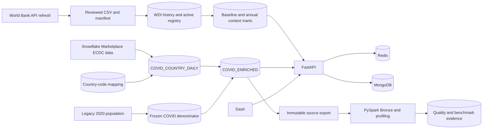

# COVID-19 Analytics Platform

This bootcamp project builds a COVID-19 data platform with Snowflake, FastAPI, Dash, MongoDB, Redis, and PySpark.

The production application uses ECDC data from Snowflake Marketplace. A parallel Snowflake extension preserves ECDC history and continues comparable country series with normalized JHU data through March 2023. It adds versioned World Development Indicators (WDI) for country context.

The project keeps the WDI context separate from the frozen 2020 population denominator. This rule prevents source revisions from changing published COVID rates.

See [World Bank country context](docs/architecture/world-bank-context.md) for the complete WDI architecture and migration policy.

## Start here: run the project from a new computer

Use this section for the normal setup. Run the steps in order from the repository root.

The normal workflow requires **Docker only**. You do not need to install Python, uv, Java, MongoDB, Redis, or Snowflake command-line tools.

Setup builds a private Python/uv environment inside Docker. The application then runs in four local containers.

### What the project starts

| System | Address | Purpose |
| --- | --- | --- |
| Dash | <http://localhost:8050/overview> | Interactive dashboard |
| FastAPI | <http://localhost:8000/docs> | API and Swagger UI |
| MongoDB | `127.0.0.1:27017` | User annotations |
| Redis | Docker network only | API cache and query-budget protection |
| Snowflake | Remote trial account | Marketplace data and analytical marts |

Redis is a required dependency for analytical routes. The API does not query Snowflake when Redis is unavailable.

This fail-closed rule protects Snowflake trial credits. It also prevents concurrent cache misses from creating duplicate warehouse queries.

### 1. Create the Snowflake account

1. Open the [Snowflake trial registration page](https://signup.snowflake.com/).
2. Select **Amazon Web Services (AWS)**.
3. Select **Europe (Stockholm)**.
4. Create the account.
5. Sign in to Snowsight.
6. Save the organization name, account name, username, and password in a password manager.

Use `organization-account` for `SNOWFLAKE_ACCOUNT`. Do not use a URL, regional hostname, or `snowflakecomputing.com` hostname.

### 2. Add the Marketplace database

1. Open **Data Products** or **Marketplace** in Snowsight.
2. Find the free **COVID-19 Epidemiological Data** listing.
3. Add the listing to the current account.
4. Name the database `COVID19_EPIDEMIOLOGICAL_DATA`.
5. Open a Snowsight worksheet.
6. Run this query:

```sql
SELECT *
FROM COVID19_EPIDEMIOLOGICAL_DATA.PUBLIC.ECDC_GLOBAL
LIMIT 1;

SELECT *
FROM COVID19_EPIDEMIOLOGICAL_DATA.PUBLIC.JHU_COVID_19_TIMESERIES
LIMIT 1;
```

Both queries must return a row. A different COVID database or object does not meet this project contract.

### 3. Install Docker

On Windows or macOS, install [Docker Desktop](https://www.docker.com/products/docker-desktop/).

On Linux, install Docker Engine and the Compose v2 plugin from the [Docker documentation](https://docs.docker.com/engine/install/).

Start the Docker engine. Then run these checks:

```bash
docker --version
docker info
docker compose version
```

`docker info` must show a **Server** section. If Linux reports a permission error, configure non-root Docker access.

Git is optional. Use Git for normal updates, or download a ZIP file from GitHub.

Verify Git if you use it:

```bash
git --version
```

### 4. Get the repository

With Git, run:

```bash
git clone <repository-url>
cd bootcamp-project
```

Without Git, download the repository ZIP. Extract it and open the `bootcamp-project` folder in a terminal.

On Windows, verify the current folder:

```powershell
Get-Location
Get-Item README.md, compose.yaml, setup.ps1, setup.sh
```

On macOS or Linux, verify the current folder:

```bash
pwd
ls README.md compose.yaml setup.ps1 setup.sh
```

If a file is missing, change to the repository root before setup.

### 5. Understand the configuration

Setup creates `.env` from `.env.example`. It prompts only for missing account values and secrets.

Setup backs up an existing `.env` file before replacement. Git and Docker both ignore the file.

Do not commit `.env`. Do not paste its contents into an issue or log.

#### Snowflake variables

| Variable | Required value |
| --- | --- |
| `SNOWFLAKE_ACCOUNT` | Connector identifier in `organization-account` form |
| `SNOWFLAKE_USER` | Snowflake login name |
| `SNOWFLAKE_PASSWORD` | Snowflake login password |
| `SNOWFLAKE_BOOTSTRAP_ROLE` | `ACCOUNTADMIN` for one-time account setup |
| `SNOWFLAKE_ROLE` | `COVID_PROJECT_ADMIN` for deployment |
| `SNOWFLAKE_API_ROLE` | `COVID_APP_ROLE` for runtime reads |
| `SNOWFLAKE_WAREHOUSE` | `COVID_WH` |
| `SNOWFLAKE_DATABASE` | `COVID_ANALYTICS` |
| `SNOWFLAKE_SCHEMA` | `RAW` |
| `SNOWFLAKE_API_SCHEMA` | `MARTS` |
| `SNOWFLAKE_LOGIN_TIMEOUT_SECONDS` | `10` by default |
| `SNOWFLAKE_NETWORK_TIMEOUT_SECONDS` | `30` by default |
| `SNOWFLAKE_STATEMENT_TIMEOUT_SECONDS` | `30` by default for API statements |
| `SNOWFLAKE_QUERY_TAG_PREFIX` | `covid-api` by default |
| `COVID_DATASET` | `extended` for the promoted ECDC/JHU series; `legacy` for rollback |

Keep the three roles separate. Do not use `ACCOUNTADMIN` as the API role.

#### Local service variables

| Variable | Purpose |
| --- | --- |
| `MONGO_ROOT_USERNAME` | Root user for the project MongoDB container |
| `MONGO_ROOT_PASSWORD` | Root password for the project MongoDB container |
| `MONGO_DATABASE` | Application database, normally `covid_app` |
| `MONGODB_URI` | MongoDB connection string |
| `REDIS_URL` | Redis connection string |
| `CACHE_NAMESPACE` | Version prefix for cached responses |
| `DASHBOARD_API_BASE_URL` | API address used inside the dashboard container |
| `DASHBOARD_PUBLIC_API_BASE_URL` | API address used by the host browser |

If the MongoDB password is blank, setup generates a strong password. Setup also builds the encoded MongoDB URI.

### 6. Run the one-time setup

Before this step, make sure that Docker is running.

On Windows PowerShell, run:

```powershell
Set-ExecutionPolicy -Scope Process Bypass
.\setup.ps1
```

The execution-policy change applies only to the current PowerShell process.

On macOS or Linux, run:

```bash
chmod +x setup.sh start.sh stop.sh
./setup.sh
```

The setup process completes nine operations:

1. It checks Docker, Compose, file permissions, and required ports.
2. It creates or validates `.env` without printing secrets.
3. It checks the Marketplace database and the `ECDC_GLOBAL` and `JHU_COVID_19_TIMESERIES` tables.
4. It creates the warehouse, resource monitor, database, schemas, and roles.
5. It publishes the committed WDI snapshot without a network request.
6. It preserves the frozen COVID population denominator.
7. It creates the staging views, analytical marts, and reporting objects.
8. It starts FastAPI, Dash, MongoDB, and Redis.
9. It creates MongoDB indexes and runs application checks.

The process writes a redacted JSONL audit log under `outputs/setup/`.

If setup stops, correct the reported cause. Then resume it.

On Windows, run:

```powershell
.\setup.ps1 --resume
```

On macOS or Linux, run:

```bash
./setup.sh --resume
```

Resume skips a step only when its checksum, setup identity, and live postcondition still match.

For unattended setup, prepare a complete `.env` file. Then use `--non-interactive` with `--resume`.

```powershell
.\setup.ps1 --resume --non-interactive
```

```bash
./setup.sh --resume --non-interactive
```

### 7. Verify the setup

Run:

```bash
docker compose ps
```

The `api`, `dashboard`, `mongo`, and `redis` services must be healthy.

On Windows PowerShell, run:

```powershell
Invoke-RestMethod http://localhost:8000/health/live
Invoke-RestMethod http://localhost:8000/health/ready
Invoke-RestMethod http://localhost:8000/countries
```

On macOS or Linux, run:

```bash
curl -i http://localhost:8000/health/live
curl -i http://localhost:8000/health/ready
curl -i http://localhost:8000/countries
```

The health routes must return HTTP `200`. The countries route must return a non-empty JSON list.

Call the Snowflake check only when you need a live warehouse test. This request can resume `COVID_WH`.

```bash
curl -i http://localhost:8000/health/snowflake
```

### 8. Use the dashboard

Open <http://localhost:8050/overview>.

| Page | Purpose |
| --- | --- |
| Status | Check API, MongoDB, Redis, and Snowflake status |
| Overview | Review global totals, rankings, and the map |
| Country Explorer | Review COVID metrics and pre-pandemic country context |
| Comparison | Compare COVID outcomes first, then five WDI country baselines |
| Forecast | Compare forecast candidates and error measures |
| Annotations | Add and review country-date notes |

The dashboard does not check Snowflake during page load. Select **Check Snowflake** when you need that test.

### 9. Start and stop the project

After the first setup, use the start script for daily work.

```powershell
.\start.ps1
```

```bash
./start.sh
```

Use the stop script to stop containers without deleting data.

```powershell
.\stop.ps1
```

```bash
./stop.sh
```

`setup` creates the environment. `start` starts existing services. `stop` preserves MongoDB, Redis, and Snowflake data.

### 10. Quick recovery

- If Docker is unavailable, start its engine and run `docker info`.
- If a port is busy, identify its owner before you stop any process.
- If Snowflake rejects authentication, check the connector account identifier and credentials.
- If setup cannot find the Marketplace object, check the account and database name.
- If an analytical route returns `503`, read `error.code` and `request_id`.
- If Redis is unavailable, restore Redis instead of bypassing the cache.
- If dashboard requests fail, use `http://api:8000` inside Compose.
- If MongoDB credentials changed, restore the credentials that created the volume.

For individual recovery steps, use [Advanced: manual setup and recovery](#advanced-manual-setup-and-recovery).

## Current capabilities

- Create a Snowflake warehouse, resource monitor, database, schemas, and least-privilege roles.
- Read daily global COVID data from `ECDC_GLOBAL`.
- Build a parallel ECDC-to-JHU continuation without changing API-facing marts.
- Normalize known country and ISO-code exceptions.
- Preserve negative case and death corrections.
- Publish a versioned 2019-2021 WDI snapshot.
- Keep the active WDI context separate from the frozen COVID denominator.
- Build daily, cumulative, per-capita, mortality, and country-context marts.
- Detect sustained case increases with Snowflake `MATCH_RECOGNIZE`.
- Export repeatable EDA results as CSV files.
- Serve typed FastAPI endpoints and a seven-page Dash application.
- Cache analytical responses with Redis.
- Store indexed annotations in MongoDB.
- Compare two simple forecast models with temporal validation.
- Build immutable PySpark Bronze data and benchmark evidence.
- Run Ruff, isort, Black, unit tests, and GitHub Actions.

Clustering is not included because it is a bonus task. Authentication and user preferences also remain outside this project scope.

## Data sources and table selection

### Epidemiological source

The production API reads the promoted parallel marts built from `COVID19_EPIDEMIOLOGICAL_DATA.PUBLIC.ECDC_GLOBAL` and `COVID19_EPIDEMIOLOGICAL_DATA.PUBLIC.JHU_COVID_19_TIMESERIES`. The Spark pipeline remains ECDC-only.

`ECDC_GLOBAL` has a country-date grain and daily case and death measures. This grain supports global comparisons, forecasts, and daily pattern detection.

`JHU_COVID_19_TIMESERIES` mixes country, province, and county rows and stores cumulative measures by case type. The extension normalizes it to one row per ISO3 and date before deriving daily changes.

The sources are spliced rather than blended. Shared countries use ECDC through their governed boundary and JHU afterward. Spain switches on 2020-12-14; other shared countries switch on 2020-12-15. Eight JHU-only countries retain their full JHU history from 2020-01-22. `COVID_DATASET=extended` is the API default; `COVID_DATASET=legacy` restores the original ECDC-only reads without changing either set of marts. API summaries label populated denominators as `ACTIVE` or `CANDIDATE`; the status is `null` when no denominator is available.

### Tables not used as COVID facts

| Group | Examples | Reason for exclusion |
| --- | --- | --- |
| Weekly data | `ECDC_GLOBAL_WEEKLY` | Weekly rows do not support daily forecasts or patterns |
| Alternative global feeds | `JHU_COVID_19`, `WHO_TIMESERIES` | The extension uses the reviewed `JHU_COVID_19_TIMESERIES` normalization contract instead |
| Country-specific feeds | `NYT_US_COVID19`, `PCM_DPS_COVID19`, `SCS_BE_*` | Their geographic grain does not match the global model |
| Mobility and policy | `APPLE_MOBILITY`, `GOOG_GLOBAL_MOBILITY_REPORT`, `HDX_ACAPS` | They require a separate lag and causal analysis |
| Vaccination | `JHU_VACCINES`, `OWID_VACCINATIONS` | Their main period is later than the COVID fact window |
| Model output | `IHME_COVID_19` | Model output must not replace observed cases or deaths |

### World Bank context

The project uses five WDI indicators for 2019-2021:

| Indicator | Meaning | Use |
| --- | --- | --- |
| `SP.POP.TOTL` | Annual population | Country context only |
| `EN.POP.DNST` | Population density | Contact-environment context |
| `SP.POP.65UP.TO.ZS` | Population aged 65 and older | Age-vulnerability context |
| `NY.GDP.PCAP.KD` | Real GDP per person | Pre-pandemic baseline and descriptive change |
| `SH.XPD.CHEX.PP.CD` | Health expenditure per person, PPP | Health-system context |

The 2019 baseline precedes the COVID outcome period. This order reduces temporal leakage in descriptive comparisons.

The WDI fields do not enter the forecasting code. The forecast uses only the report date and an incident COVID metric.

### Population denominator policy

The project keeps two population concepts:

- `POPULATION_2020_CONTEXT` is the active WDI context value.
- `COVID_RATE_POPULATION_2020` is the frozen denominator for published COVID rates.

A normal WDI publication cannot change the frozen denominator. A denominator change needs a reviewed migration and rate reconciliation.

## Architecture


```mermaid
flowchart LR
    Market[Snowflake Marketplace ECDC data] --> Staging[(COVID_COUNTRY_DAILY)]
    Mapping[(Country-code mapping)] --> Staging
    WB[World Bank API refresh] --> Snapshot[Reviewed CSV and manifest]
    Snapshot --> Registry[(WDI history and active registry)]
    Registry --> Context[(Baseline and annual context marts)]
    Legacy[Legacy 2020 population] --> Denominator[(Frozen COVID denominator)]
    Staging --> Marts[(COVID_ENRICHED)]
    Denominator --> Marts
    Context --> API[FastAPI]
    Marts --> API
    API --> Redis[(Redis)]
    API --> Mongo[(MongoDB)]
    Browser[Dash] --> API
    Marts --> Export[Immutable source export]
    Export --> Spark[PySpark Bronze and profiling]
    Spark --> Evidence[(Quality and benchmark evidence)]
```

## Technology stack

| Area | Technology |
| --- | --- |
| API | FastAPI and Uvicorn |
| Dashboard | Plotly Dash and Plotly |
| Warehouse | Snowflake SQL |
| Data processing | pandas and PySpark 3.5.6 |
| External data | World Bank API |
| Operational database | MongoDB 7.0 |
| Cache | Redis 7.4 |
| Runtime | Python 3.12.13 |
| Dependencies | uv, `pyproject.toml`, and `uv.lock` |
| Containers | Docker Compose |
| Quality | Ruff, isort, Black, pre-commit, and GitHub Actions |

## Advanced: manual setup and recovery

Use this section when the guided setup cannot complete. Contributors can also use it to inspect each deployment step.

The manual workflow requires Git, Docker, and uv. The normal user workflow above still requires Docker only.

### 1. Install contributor tools

Install [Git](https://git-scm.com/downloads), [Docker](https://docs.docker.com/get-docker/), and [uv](https://docs.astral.sh/uv/getting-started/installation/).

On Windows, install uv with:

```powershell
powershell -ExecutionPolicy ByPass -c "irm https://astral.sh/uv/install.ps1 | iex"
```

On macOS or Linux, install uv with:

```bash
curl -LsSf https://astral.sh/uv/install.sh | sh
```

Open a new terminal after installation. Then verify each tool.

```bash
git --version
docker --version
docker compose version
uv --version
```

### 2. Install the locked Python environment

From the repository root, run:

```bash
uv sync --locked
uv run python --version
```

The Python version must satisfy `.python-version` and `pyproject.toml`.

### 3. Create Snowflake account objects

Open [`sql/00_project_setup.sql`](sql/00_project_setup.sql) in Snowsight. Run it as `ACCOUNTADMIN`.

The file creates these objects:

- `COVID_PROJECT_MONITOR`, with a five-credit monthly quota.
- `COVID_WH`, as X-Small Gen2 with 60-second automatic suspension and Query Acceleration disabled.
- `COVID_ANALYTICS`, which owns project data.
- `COVID_PROJECT_ADMIN`, which deploys project objects.
- `COVID_APP_ROLE`, which reads API marts.

The monitor notifies at 50 percent. It suspends the warehouse at 80 percent and immediately suspends it at 100 percent.

Review the quota before you run the file. A trial-account owner remains responsible for credit use.

Grant both project roles to the deployment user:

```sql
GRANT ROLE COVID_PROJECT_ADMIN TO USER YOUR_SNOWFLAKE_USERNAME;
GRANT ROLE COVID_APP_ROLE TO USER YOUR_SNOWFLAKE_USERNAME;
```

Run [`sql/00_project_objects.sql`](sql/00_project_objects.sql) after both grants succeed.

This file creates `RAW`, `STAGING`, `MARTS`, and `APP`. It also grants the MARTS read contract to `COVID_APP_ROLE`.

FastAPI uses only `COVID_APP_ROLE`. This role cannot create or replace project objects.

### 4. Explore the Marketplace source

Run [`sql/01_data_exploration.sql`](sql/01_data_exploration.sql).

The queries check these conditions:

- Required columns exist.
- The date range and country coverage are known.
- Country-date duplicates are visible.
- Required values have measured null counts.
- Negative values remain visible as source corrections.
- `CASES` and `DEATHS` are daily values.

Do not derive daily values from another subtraction. The source already supplies daily measures.

### 5. Create the staging layer

Run [`sql/02_create_country_mapping.sql`](sql/02_create_country_mapping.sql).

The mapping fixes reviewed country and code exceptions. It also marks locations that do not need a population match.

Run [`sql/03_create_staging_view.sql`](sql/03_create_staging_view.sql).

The staging view has one row per normalized location and date. It aggregates duplicate source rows before cumulative calculations.

The view preserves negative corrections. It records the source row count and mapping status for audit work.

### 6. Configure the Python connection

Copy `.env.example` to `.env`. Replace the Snowflake placeholders.

```dotenv
SNOWFLAKE_ACCOUNT=organization-account-from-step-1
SNOWFLAKE_USER=your_username
SNOWFLAKE_PASSWORD=your_password
SNOWFLAKE_ROLE=COVID_PROJECT_ADMIN
SNOWFLAKE_WAREHOUSE=COVID_WH
SNOWFLAKE_DATABASE=COVID_ANALYTICS
SNOWFLAKE_SCHEMA=RAW
```

Run the configured doctor without printing secret values:

```bash
uv run --locked python -m scripts.bootstrap doctor --configured
```

### 7. Publish the World Bank context

Normal setup uses the committed WDI artifacts. It does not contact the World Bank API.

```bash
uv run python -m scripts.world_bank_indicators publish
```

The publisher validates the manifest, observations, identities, and coverage. It activates one snapshot only after all checks pass.

Run the verifier:

```bash
uv run python scripts/verify_world_bank_context.py
```

The legacy population file seeds the frozen denominator only when that denominator does not exist.

### 8. Create the analytical marts

Run [`sql/04_create_world_bank_context.sql`](sql/04_create_world_bank_context.sql).

Run [`sql/05_create_enriched_view.sql`](sql/05_create_enriched_view.sql).

Run [`sql/06_create_reporting_objects.sql`](sql/06_create_reporting_objects.sql).

Run [`sql/09_create_jhu_extension.sql`](sql/09_create_jhu_extension.sql).

Run [`sql/07_analysis_queries.sql`](sql/07_analysis_queries.sql).

The build order prevents circular dependencies. It also keeps WDI publication separate from the COVID denominator.

The Snowflake object flow is:

```text
COVID19_EPIDEMIOLOGICAL_DATA.PUBLIC.ECDC_GLOBAL
    + COVID_ANALYTICS.RAW.COUNTRY_CODE_MAPPING
    -> COVID_ANALYTICS.STAGING.COVID_COUNTRY_DAILY

World Bank API
    -> reviewed CSV, manifest, and evidence
    -> RAW.WORLD_BANK_COUNTRY_INDICATORS
    -> STAGING.WORLD_BANK_COUNTRY_INDICATORS_CURRENT
    -> MARTS.COUNTRY_BASELINE_2019
    -> MARTS.COUNTRY_INDICATOR_ANNUAL

COVID_ANALYTICS.STAGING.COVID_COUNTRY_DAILY
    + MARTS.COUNTRY_COVID_DENOMINATOR
    -> MARTS.COVID_ENRICHED
    -> MARTS.COUNTRY_LATEST_METRICS

MARTS.COUNTRY_BASELINE_2019
    + MARTS.COUNTRY_INDICATOR_ANNUAL
    + MARTS.COUNTRY_LATEST_METRICS
    -> MARTS.COUNTRY_CONTEXT_ANALYSIS

COVID_ANALYTICS.STAGING.COVID_COUNTRY_DAILY
    -> MARTS.CASE_INCREASE_PATTERNS

COVID19_EPIDEMIOLOGICAL_DATA.PUBLIC.JHU_COVID_19_TIMESERIES
    + RAW.JHU_GEOGRAPHY_POLICY
    + STAGING.CANONICAL_COUNTRY_CODE_MAP
    -> STAGING.JHU_COUNTRY_CUMULATIVE
    -> STAGING.JHU_COUNTRY_DAILY

STAGING.COVID_COUNTRY_DAILY
    + STAGING.JHU_COUNTRY_DAILY
    -> STAGING.COVID_COUNTRY_DAILY_EXTENDED
    -> MARTS.CASE_INCREASE_PATTERNS_EXTENDED_DATA (transient refresh table)
    -> MARTS.CASE_INCREASE_PATTERNS_EXTENDED (stable public view)
    -> MARTS.COVID_ENRICHED_EXTENDED_DATA (transient refresh table)
    -> MARTS.COVID_ENRICHED_EXTENDED (stable public view)
    -> MARTS.COUNTRY_LATEST_METRICS_EXTENDED
```

### 9. Start the local services

Start Docker before this step. Then run:

```bash
docker compose config
docker compose up -d --build
docker compose ps
```

Create the MongoDB collection and indexes:

```bash
docker compose exec api python -m scripts.setup_mongodb
```

### 10. Check the complete application

Run these requests:

```bash
curl -i http://localhost:8000/health/live
curl -i http://localhost:8000/health/ready
curl -i http://localhost:8000/health/snowflake
curl -i http://localhost:8000/countries
curl -i http://localhost:8000/dashboard/overview
```

Open <http://localhost:8050/overview>. Confirm that the Overview page contains data.

### Completion checklist

- [ ] Snowflake uses AWS Stockholm.
- [ ] `COVID19_EPIDEMIOLOGICAL_DATA.PUBLIC.ECDC_GLOBAL` returns data.
- [ ] `COVID19_EPIDEMIOLOGICAL_DATA.PUBLIC.JHU_COVID_19_TIMESERIES` returns data.
- [ ] `COVID_WH` and `COVID_PROJECT_MONITOR` exist.
- [ ] `STAGING.COVID_COUNTRY_DAILY` contains rows.
- [ ] `RAW.WORLD_BANK_INDICATOR_SNAPSHOTS` has one active snapshot.
- [ ] `MARTS.COUNTRY_COVID_DENOMINATOR` contains frozen population rows.
- [ ] `MARTS.COUNTRY_BASELINE_2019` contains eligible countries.
- [ ] `MARTS.COVID_ENRICHED` contains rows.
- [ ] `MARTS.COUNTRY_LATEST_METRICS` contains rows.
- [ ] `STAGING.COVID_COUNTRY_DAILY_EXTENDED` contains 222 locations.
- [ ] `MARTS.COUNTRY_LATEST_METRICS_EXTENDED` contains 222 rows.
- [ ] `MARTS.CASE_INCREASE_PATTERNS_EXTENDED` contains valid pattern rows.
- [ ] All four local services are healthy.
- [ ] The liveness, readiness, and Snowflake checks succeed.
- [ ] Two equal overview requests return `MISS` and then `HIT`.

## API endpoints

| Method | Path | Purpose |
| --- | --- | --- |
| `GET` | `/health`, `/health/live` | Check process liveness without dependency calls |
| `GET` | `/health/ready` | Check MongoDB and Redis |
| `GET` | `/health/snowflake` | Check Snowflake and required marts |
| `GET` | `/countries` | List canonical country identities |
| `GET` | `/countries/{identifier}/summary` | Get the latest country metrics |
| `GET` | `/countries/{identifier}/timeseries` | Get a filtered metric series |
| `GET` | `/countries/{identifier}/context` | Get versioned WDI context |
| `GET` | `/compare` | Compare one metric for two to ten countries |
| `GET` | `/forecast` | Get an evaluated daily forecast |
| `GET` | `/patterns/case-increases` | Explore sustained daily case-increase patterns |
| `GET` | `/dashboard/overview` | Get the complete Overview payload |
| `GET` | `/dashboard/countries/{identifier}` | Get the complete Country Explorer payload |
| `GET` | `/dashboard/compare` | Get the complete Comparison payload |
| `POST` | `/annotations` | Validate and create an annotation |
| `GET` | `/annotations` | Get filtered annotations |
| `GET` | `/docs` | Open Swagger UI |

The `/dashboard/compare` response keeps the existing COVID series and adds an
optional `world_bank_context` object to each country. The object contains the five
baseline indicators and the active snapshot ID. Its companion
`world_bank_context_status` is `available` or `context_data_unavailable`. Missing or
stale WDI context does not remove COVID results. `countries_without_data` continues
to mean that the requested date range has no COVID observations.

### Acceptance requests

```bash
curl -i http://localhost:8000/health/live
curl -i http://localhost:8000/health/ready
curl -i http://localhost:8000/health/snowflake
curl -i http://localhost:8000/dashboard/overview
curl -i http://localhost:8000/dashboard/overview
curl -i "http://localhost:8000/dashboard/countries/LV?metric=cases_per_100k&start_date=2020-03-01&end_date=2023-03-09"
curl -i "http://localhost:8000/dashboard/compare?country=LV&country=EE&start_date=2020-03-01&end_date=2023-03-09"
curl -i http://localhost:8000/countries/LV/summary
curl -i http://localhost:8000/countries/LV/context
curl -i "http://localhost:8000/forecast?country=LV&metric=new_cases&days=30&lookback_days=90"
curl -i "http://localhost:8000/patterns/case-increases?start_date=2020-03-01&end_date=2023-03-09&minimum_consecutive_increases=3&limit=100"
```

The first overview response should include `X-Cache: MISS`. The second equal request should include `X-Cache: HIT`.

### Cache policy

Stable analytical responses, including case-increase patterns, use a 24-hour time to live. Forecasts use a six-hour time to live. Every COVID-derived cache key includes `COVID_DATASET`, so legacy and extended responses cannot collide. Comparison and combined-page keys also include the committed WDI snapshot ID. WDI-only context keys remain snapshot-based.

If the WDI manifest cannot be read, an optional combined page uses the explicit context revision `unavailable`. This allows the COVID-only response to be cached without sharing identity with a valid WDI snapshot. The context-only route still fails closed because it cannot satisfy its contract without a verified snapshot.

The stampede lock has a 60-second lease and waiters stop after 15 seconds. These bounds cover the 30-second Snowflake statement timeout without permitting an abandoned lock to stall requests for a full cache TTL.

The promoted dataset uses `CACHE_NAMESPACE=covid-api:v4`. Change the namespace when response semantics change. Clear only the project prefix after a mart refresh.

```bash
docker compose exec api python -m scripts.clear_cache
```

The script uses incremental Redis `SCAN` calls. It does not flush unrelated Redis data. Refresh in this order: rebuild and validate the Snowflake marts, rebuild `COUNTRY_LATEST_METRICS_EXTENDED`, and only then clear the project cache prefix. A failed publication therefore leaves the last-known-good cache intact.

Page-level dashboard stores prevent one API request per chart. Render callbacks use the stored page payload.

### Snowflake performance validation

The extended serving path materializes the expensive source splice, denominator enrichment, WDI joins, cumulative windows, and `MATCH_RECOGNIZE` work during controlled publication. `COVID_ENRICHED_EXTENDED` and `CASE_INCREASE_PATTERNS_EXTENDED` remain stable public views over transient `_DATA` tables, so API routes and response contracts do not change. Rerunning `sql/09_create_jhu_extension.sql` owns the complete refresh lifecycle.

The live 31 July 2026 comparison used one warmup and five measured repetitions with Snowflake result-cache reuse disabled. Median Snowflake elapsed time fell from 1,471–2,350 ms to 149–470 ms across every detailed operation; compilation fell by 70.7–90.1%. Results, coverage, key uniqueness, and unordered hashes remained equal. All 30 measured post-change statements recorded zero queue time, spill, and Query Acceleration activity; the excluded first warmup recorded 82 ms of provisioning queue while the warehouse resumed. The full method, limits, query-tag runs, and results are in [`reports/snowflake/optimization_evidence_2026-07-31.md`](reports/snowflake/optimization_evidence_2026-07-31.md); sanitized per-query data is in [`reports/snowflake/performance_evidence.json`](reports/snowflake/performance_evidence.json).

The warehouse contract is reasserted on every setup: X-Small Gen2, 60-second auto-suspend, attached resource monitor, and Query Acceleration disabled. QAS was not used by the measured workload and is separately billed serverless compute outside resource-monitor control. The checked-in monitor quota remains five credits for normal bootcamp use; the live account used a temporary 25-credit audit allowance.

No clustering key, automatic clustering, or Search Optimization is configured. The materialized enriched table is only 224,265 rows and 8.43 MB across eight micro-partitions, while detailed Snowflake medians are already below 0.5 seconds. Their maintenance or serverless cost is not justified at this scale.

To repeat the comparison, run the capture script with phase `pre_materialization`, deploy with the normal bootstrap path, then run it with phase `post_materialization`, using the same environment file and output path. The script disables result-cache reuse, applies run-specific query tags, and stores query IDs, connection and Snowflake timings, bytes, pruning, queue, QAS, and spill evidence. The command is:

```bash
uv run python scripts/capture_snowflake_performance.py --phase post_materialization --env-file .env --output reports/snowflake/performance_evidence.json --warmups 1 --repetitions 5
```

Use `pre_materialization` for the first phase. Account Usage `QUERY_HISTORY` can lag by up to 45 minutes, so the script uses Information Schema history for immediate measurements. Warehouse credits are aggregate and cannot be attributed solely to API traffic; the query tags identify the statements in scope.

### Annotation workflow

Create or verify the MongoDB indexes:

```bash
docker compose exec api python -m scripts.setup_mongodb
```

Create an annotation:

```bash
curl -i -X POST http://localhost:8000/annotations \
  -H "Content-Type: application/json" \
  -d '{"country":"LV","report_date":"2020-03-15","metric":"new_cases","comment":"Reporting delay.","created_by":"Student"}'
```

Read the annotation:

```bash
curl -i "http://localhost:8000/annotations?country=LV&metric=new_cases&start_date=2020-03-01&end_date=2020-03-31"
```

The API validates the country and report date against Snowflake before insertion. MongoDB stores canonical country identity fields.

## Configuration reference

| Variable | Used by | Purpose |
| --- | --- | --- |
| `SNOWFLAKE_ACCOUNT` | Setup and Snowflake clients | Connector account identifier |
| `SNOWFLAKE_USER` | Setup and Snowflake clients | Login name |
| `SNOWFLAKE_PASSWORD` | Setup and Snowflake clients | Login password |
| `SNOWFLAKE_BOOTSTRAP_ROLE` | Setup | Account-level setup role |
| `SNOWFLAKE_ROLE` | Deployment scripts | Project deployment role |
| `SNOWFLAKE_API_ROLE` | FastAPI | Read-only runtime role |
| `SNOWFLAKE_WAREHOUSE` | Snowflake clients | Compute warehouse |
| `SNOWFLAKE_DATABASE` | Snowflake clients | Project database |
| `SNOWFLAKE_SCHEMA` | Deployment scripts | Default deployment schema |
| `SNOWFLAKE_API_SCHEMA` | FastAPI | Analytical schema |
| `SNOWFLAKE_LOGIN_TIMEOUT_SECONDS` | FastAPI | Connector login retry bound; default 10 seconds |
| `SNOWFLAKE_NETWORK_TIMEOUT_SECONDS` | FastAPI | Connector network retry bound; default 30 seconds |
| `SNOWFLAKE_STATEMENT_TIMEOUT_SECONDS` | FastAPI | Snowflake statement bound; default 30 seconds |
| `SNOWFLAKE_QUERY_TAG_PREFIX` | FastAPI | Query attribution prefix; default `covid-api` |
| `SNOWFLAKE_USE_CACHED_RESULT` | FastAPI and profiler | Snowflake result-cache policy; enabled for serving and disabled by the profiler |
| `COVID_DATASET` | FastAPI | Select `extended` or the `legacy` rollback marts |
| `MONGO_ROOT_USERNAME` | Compose | MongoDB root user |
| `MONGO_ROOT_PASSWORD` | Compose | MongoDB root password |
| `MONGO_DATABASE` | Compose and FastAPI | Application database |
| `MONGODB_URI` | FastAPI | MongoDB connection string |
| `REDIS_URL` | FastAPI | Redis connection string |
| `CACHE_NAMESPACE` | FastAPI | Version prefix for cache keys |
| `CACHE_TTL_*` | FastAPI | Endpoint time-to-live values |
| `CACHE_LOCK_SECONDS` | FastAPI | Per-key lock lease; default 60 seconds |
| `CACHE_LOCK_WAIT_SECONDS` | FastAPI | Cache-fill waiter bound; default 15 seconds |
| `DASHBOARD_API_BASE_URL` | Dash | Internal API URL |
| `DASHBOARD_PUBLIC_API_BASE_URL` | Browser links | Host-visible API URL |

Compose replaces host addresses with container-network addresses. Never commit `.env`.

## World Bank context lifecycle

Normal setup publishes committed data. It does not contact the World Bank API.

Use the network refresh only when you want to review a new source snapshot:

```bash
uv run python -m scripts.world_bank_indicators refresh
```

The refresh process requests WDI source 2 for 2019-2021. It retrieves every result page for the indicator allowlist.

The process validates identities and coverage before it writes candidate files. It does not replace committed files after a failed check.

Review these artifacts together:

- The WDI CSV file.
- The manifest.
- The identity report.
- The coverage report.

Publish the reviewed snapshot:

```bash
uv run python -m scripts.world_bank_indicators publish
```

The publisher inserts observations and a registry record in one transaction. A second transaction activates the candidate and supersedes its predecessor.

Exactly one registry row can be active. Application code enforces this rule because Snowflake standard-table keys do not enforce uniqueness.

### Identity and grain

The raw WDI grain is:

```text
SNAPSHOT_ID + CANONICAL_ISO3 + INDICATOR_CODE + OBSERVATION_YEAR
```

Country names are display values. The project never uses them as WDI join keys.

The publisher accepts non-aggregate economies with a canonical ISO3 code. A reviewed mapping can also supply an approved identity.

Conflicting identities stop publication. Unsupported and aggregate entities remain in evidence but do not enter canonical observations.

### Coverage gates

| Indicator | Minimum coverage | Maximum drop |
| --- | ---: | ---: |
| `SP.POP.TOTL` | 95% | 5 percentage points |
| `EN.POP.DNST` | 90% | 5 percentage points |
| `SP.POP.65UP.TO.ZS` | 90% | 5 percentage points |
| `NY.GDP.PCAP.KD` | 80% | 5 percentage points |
| `SH.XPD.CHEX.PP.CD` | 75% | 10 percentage points |

Different indicators use different gates because their source coverage differs. A missing indicator-year pair always stops publication.

### Checksums

`app/world_bank.py` defines one cross-platform serialization protocol. It fixes row order, column order, Unicode form, line endings, nulls, and decimals.

The observation checksum represents logical source data. The file checksum represents the exact committed CSV bytes.

Python and Spark use the same scalar rules. Golden tests detect newline, decimal, and null-format drift.

### Migration and rollback

The API selects COVID marts through an internal allowlist. The normal setting is:

```dotenv
COVID_DATASET=extended
CACHE_NAMESPACE=covid-api:v4
```

For an immediate application rollback, set `COVID_DATASET=legacy`, choose a new cache namespace, and restart the API. This changes reads only; it does not rename, replace, or delete either mart family.

Run the migration reconciliation before a consumer cutover:

```bash
uv run python scripts/reconcile_world_bank_migration.py
```

The reconciliation requires equal case, death, and denominator values. It applies small documented tolerances to calculated rates.

Use [`sql/08_migrate_population_compatibility.sql`](sql/08_migrate_population_compatibility.sql) only after one verified release.

Snapshot rollback and denominator rollback are separate operations. Publishing WDI data cannot change the COVID rate denominator.

## Forecasting

`GET /forecast` supports `new_cases` and `new_deaths`. The forecast horizon is 1-30 days.

The training window is 42-180 observations. The default window contains 90 observations.

The service compares two candidates:

- A seven-day mean represents the recent reporting level.
- A linear trend uses at most the latest 42 observations.

The service validates both candidates on the last 14 observations. Each validation prediction uses only earlier data.

The candidate with the lower mean absolute error wins. An equal score selects the simpler seven-day mean.

The response also reports root mean squared error. This measure makes large forecast misses visible.

The error band uses the larger selected-model error measure. It expands with the square root of the forecast horizon.

This band is descriptive. It is not a clinical or probabilistic confidence interval.

Negative source corrections stay visible in returned history. The model uses zero for a negative incident value because incidence cannot be negative.

The trend uses actual date offsets. It does not add zero observations for missing calendar days.

## Exploratory data analysis

Create `COVID_ANALYTICS.MARTS.COVID_ENRICHED` before you run the EDA script.

Run:

```bash
uv run python scripts/run_eda.py
```

The script writes these files under the ignored `outputs/eda/` directory:

- `dataset_coverage.csv`
- `missing_population.csv`
- `data_corrections.csv`
- `latest_country_metrics.csv`

The exports use the same analytical mart as the API. This rule prevents separate metric definitions in notebooks and services.

## PySpark Bronze and profiling

Spark does not serve API requests. Snowflake SQL is simpler for the current 61,900-row interactive workload.

The Spark path demonstrates explicit schemas, immutable Bronze data, quality gates, plan inspection, and measured file-layout decisions.

The pinned Spark runtime uses Python 3.12.13, PySpark 3.5.6, Java 17.0.19, and `local[2]`.

### 1. Export one source batch

Complete the Snowflake setup first. Configure `.env` for `COVID_PROJECT_ADMIN`.

```bash
uv run python scripts/export_spark_sources.py \
  --source-batch-id wdi-context-v1
```

This is the only Spark step that contacts Snowflake. It writes one immutable batch under `data/source/`.

The four-file contract contains ECDC daily data, the frozen 2020 population denominator, explicit country mappings, and the active versioned WDI observations. The batch manifest includes their row counts, byte counts, SHA-256 checksums, the WDI snapshot ID, and the accepted Snowflake country-context fingerprint. The exporter never overwrites an existing batch identifier.

### 2. Run Bronze ingestion and profiling

```bash
docker compose --profile spark build spark

docker compose --profile spark run --rm spark ingest-profile \
  --source-batch-id wdi-context-v1 \
  --ingestion-id bronze-v1 \
  --benchmark-run-id benchmark-v1
```

The job checks exact headers before parsing. It applies explicit Spark schemas to all sources.

The job keeps input and corrupt records in immutable Bronze Parquet. Quality failures block curated publication.

| Condition | Result |
| --- | --- |
| Schema drift or corrupt input | Failure |
| Missing required identity or date | Failure |
| Invalid ISO length | Failure |
| Duplicate mapping or population key | Failure |
| Non-positive population | Failure |
| Null daily measure | Warning |
| Duplicate normalized country-date | Warning |
| Recoverable missing ISO code | Warning |
| Negative case or death correction | Information |

Schema failures publish only quality evidence. Other failures can publish Bronze and quarantine evidence, but they block curated output.

Warnings allow curated publication. The Bronze manifest records the ruleset, quality result, and quality-document checksum.

### 3. Run a new benchmark

```bash
docker compose --profile spark run --rm spark benchmark \
  --ingestion-id bronze-v1 \
  --benchmark-run-id benchmark-v2
```

Each comparison uses one warm-up and five measured repetitions in one JVM. The benchmark alternates the variant order.

Both variants must pass a correctness gate before timing. The gate checks schema, row count, and a row-multiset checksum.

A failed gate stops timing and preserves the previous committed evidence. A successful suite publishes `reports/spark/evidence.json` atomically.

The benchmark covers these decisions:

- Early projection and filtering.
- Broadcast joins for small lookup data.
- Adaptive query execution.
- Persistence for a reused data frame.
- Output partition and file count.

The measured fixture does not prove that every common optimization is faster. The report separates plan changes from elapsed-time changes.

Current evidence version 3 uses source batch `wdi-context-qa-v1` and WDI snapshot `wdi2-2019-2021-372906f371e0391f`. Spark reproduced the Snowflake context baseline exactly: 213 rows, 20,199 canonical bytes, and SHA-256 `6fa8fc8208d748a8dfbd2b4d606eb09cf2faae59869dfa52c62f3b3913872d83`. The optimized plan contains three build-right broadcast hash joins for country mapping, frozen population, and the narrow WDI baseline.

| Comparison | Baseline median | Candidate median | Result |
| --- | ---: | ---: | --- |
| Early projection/filter | 183.939 ms | 216.075 ms | Candidate was not faster |
| Three broadcast joins | 762.517 ms | 561.944 ms | Candidate was faster |
| Adaptive duplicate aggregation | 347.056 ms | 426.586 ms | Candidate was not faster |
| Reused-frame cache | 323.322 ms | 372.224 ms | Candidate was not faster |
| File layout | 2,787.065 ms | 1,645.820 ms | Candidate was faster |

The final published Parquet size is 421,412 bytes, below the 128 MiB target. The pipeline therefore uses one unpartitioned file instead of many small partitions.

### 4. Run Spark tests

```bash
uv sync --locked --group spark
uv run --group spark python -m unittest discover -s spark_tests -v
```

## Local development

This workflow is for contributors who run Python outside Docker. Dashboard users do not need it.

Install the locked environment:

```bash
uv sync --locked
uv run python --version
```

Run the API after MongoDB and Redis are available:

```bash
uv run uvicorn app.main:app --reload
```

Compose supplies the service connection strings automatically. Use Compose when you do not need a host Python process.

### Dependency changes

`pyproject.toml` declares dependencies. `uv.lock` records exact resolved versions.

```bash
uv add package-name
uv add --dev development-package
uv lock --check
uv sync --locked
```

Commit `pyproject.toml` and `uv.lock` after each dependency change. Do not edit `uv.lock` manually.

## Code quality and CI

Install the Git hook once:

```bash
uv run pre-commit install
```

Run all hooks:

```bash
uv run pre-commit run --all-files
```

Run individual checks:

```bash
uv run isort --check-only --diff .
uv run black --check --diff .
uv run ruff check .
uv run python -m unittest discover -s tests -v
```

GitHub Actions runs the locked environment and quality checks for each push and pull request.

## Repository structure

```text
.
|-- app/
|   |-- api/                             # Health, analytics, and annotation routes
|   |-- dashboard/                       # Dash pages and charts
|   |-- models/                          # Pydantic contracts
|   |-- repositories/                    # Snowflake and MongoDB access
|   |-- services/                        # Cache, analytics, forecast, and annotations
|   |-- spark_pipeline/                  # Bronze, quality, and benchmark code
|   |-- world_bank.py                    # WDI contracts and checksums
|   |-- config.py                        # Typed settings
|   `-- main.py                          # FastAPI application
|-- data/external/
|   |-- world_bank_indicators_2019_2021.csv
|   `-- world_bank_population_2020.csv
|-- docs/architecture/
|   `-- world-bank-context.md            # WDI architecture decision
|-- scripts/
|   |-- bootstrap.py                     # Guided setup
|   |-- capture_snowflake_performance.py # Tagged live Snowflake evidence
|   |-- clear_cache.py                   # Prefix-scoped cache removal
|   |-- export_spark_sources.py          # Snowflake source export
|   |-- run_eda.py                       # EDA CSV export
|   |-- run_spark_bronze.py              # Spark command-line entry point
|   |-- setup_mongodb.py                 # MongoDB indexes
|   |-- update_covid_denominator.py      # Denominator lifecycle
|   `-- world_bank_indicators.py         # WDI refresh and publication
|-- sql/
|   |-- 00_project_setup.sql
|   |-- 00_project_objects.sql
|   |-- 01_data_exploration.sql
|   |-- 02_create_country_mapping.sql
|   |-- 03_create_staging_view.sql
|   |-- 04_create_world_bank_context.sql
|   |-- 05_create_enriched_view.sql
|   |-- 06_create_reporting_objects.sql
|   |-- 07_analysis_queries.sql
|   |-- 08_migrate_population_compatibility.sql
|   `-- 09_create_jhu_extension.sql
|-- reports/snowflake/                   # Sanitized before/after evidence
|-- tests/                               # Application tests
|-- spark_tests/                         # Spark tests
|-- .env.example                         # Configuration template
|-- compose.yaml                         # Application services
|-- compose.setup.yaml                   # Temporary setup service
|-- dockerfile                           # API image
|-- dockerfile.spark                     # Spark image
|-- pyproject.toml                       # Dependencies and tool settings
`-- uv.lock                              # Resolved dependency lock
```

## Troubleshooting

### Docker cannot connect

Start Docker Desktop or the Linux Docker service. Wait until `docker info` shows a Server section.

Reinstalling Python packages does not repair a stopped Docker engine.

### An API route returns `503`

Read `error.code` and `request_id` in the response. Use the request identifier to find the matching API log.

```bash
docker compose ps
docker compose logs mongo redis api
```

| Error code | Action |
| --- | --- |
| `cache_unavailable` | Check the Redis service and logs |
| `mongodb_unavailable` | Check MongoDB logs and stored credentials |
| `snowflake_configuration_invalid` | Compare variable names with `.env.example` |
| `snowflake_account_invalid` | Use `organization-account` for `SNOWFLAKE_ACCOUNT` |
| `snowflake_authentication_failed` | Check the Snowflake username and password |
| `snowflake_role_unauthorized` | Resume setup and verify the API role grant |
| `snowflake_warehouse_unavailable` | Verify `COVID_WH` and role `USAGE` |
| `snowflake_permission_denied` | Resume setup and restore project grants |
| `analytics_objects_missing` | Complete the Snowflake mart deployment |
| `context_data_unavailable` | Check the committed and active WDI snapshot identifiers |
| `snowflake_network_unavailable` | Check internet, DNS, proxy, and firewall access |

Do not change the API role to `ACCOUNTADMIN` to avoid a permission error.

### Dashboard cannot reach the API

The dashboard container must use `http://api:8000`. Inside the container, `localhost` refers to the dashboard container.

Check the bridge request:

```bash
docker compose exec -T dashboard python -c "import sys, urllib.request; sys.stdout.write(urllib.request.urlopen('http://api:8000/health/live').read().decode())"
```

### MongoDB uses old credentials

MongoDB applies root credentials only when it creates the data directory. Restore the credentials that created the current volume.

Delete the volume only when local annotations are disposable. This operation cannot be reversed.

```bash
docker compose down
docker volume rm covid-platform_mongo_data
```

Run setup with `--resume` after the deletion. The setup scripts never delete this volume automatically.

### A required port is busy

The host uses ports `8000`, `8050`, and `27017`. Run the local doctor first.

```bash
uv run --locked python -m scripts.bootstrap doctor --local
```

On Windows, identify the process:

```powershell
Get-NetTCPConnection -LocalPort 8000
Get-Process -Id <OwningProcess>
```

On macOS or Linux, identify the process:

```bash
lsof -i :8000
ss -ltnp
```

Repeat the command for the reported port. Stop only a process that you recognize.

### World Bank publication fails

Restore the committed WDI CSV and manifest from Git. Then run setup with `--resume`.

Only the explicit `refresh` command contacts the API. A failed candidate cannot replace the active Snowflake snapshot.

### Setup was interrupted

The setup command exits with status `130`. It keeps containers, volumes, and resumable state.

Run `setup.ps1 --resume` or `./setup.sh --resume`. Setup checks each completed step before it skips that step.

### A pre-commit hook changes files

Review the changes. Stage the accepted files and run the hooks again.

```bash
git add <updated-files>
uv run pre-commit run --all-files
```

### The lockfile is out of date

After an intentional dependency change, run:

```bash
uv lock
uv lock --check
```
