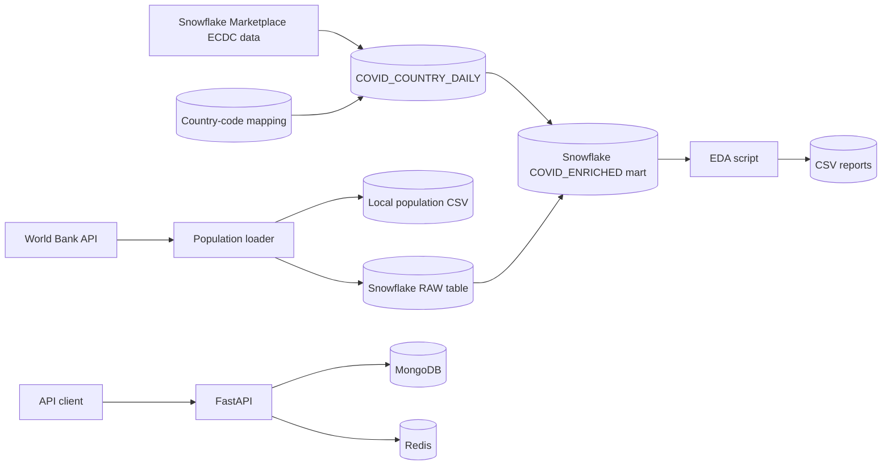

# COVID-19 Analytics Platform

A bootcamp data-engineering project that combines World Bank population data,
Snowflake analytics, a FastAPI service, MongoDB, and Redis. The repository
currently provides a reproducible development and container environment,
Snowflake setup and transformations, population ingestion, automated
exploratory-data-analysis exports, and API dependency health checks.

## Current capabilities

- Creates the Snowflake warehouse, resource monitor, database, and schemas.
- Explores the Snowflake Marketplace COVID-19 dataset and builds staging and
  enriched analytical views.
- Normalizes known country-code mismatches and classifies locations without a
  matching World Bank population record.
- Creates a latest-country reporting snapshot and detects sustained case-growth
  patterns with Snowflake `MATCH_RECOGNIZE`.
- Downloads 2020 country population data from the World Bank API, saves it
  locally, and loads it into Snowflake.
- Runs analytical queries against the included Snowflake mart and exports EDA
  results as CSV files.
- Runs FastAPI together with MongoDB and Redis through Docker Compose.
- Exposes API status and MongoDB/Redis health endpoints.
- Locks Python dependencies with uv and runs Ruff, isort, and Black locally and
  in GitHub Actions.

The API does not yet expose COVID-19 analytical queries, store application data
in MongoDB, or cache responses in Redis. Dashboarding, forecasting, and the
API-facing Snowflake views are also outside the current implementation.

## Architecture


```mermaid
flowchart LR
    Market[Snowflake Marketplace ECDC data] --> Staging[(COVID_COUNTRY_DAILY)]
    Mapping[(Country-code mapping)] --> Staging
    WB[World Bank API] --> Loader[Population loader]
    Loader --> CSV[(Local population CSV)]
    Loader --> Raw[(Snowflake RAW table)]
    Staging --> Marts[(Snowflake COVID_ENRICHED mart)]
    Raw --> Marts
    Marts --> EDA[EDA script]
    EDA --> Reports[(CSV reports)]

    Client[API client] --> API[FastAPI]
    API --> Mongo[(MongoDB)]
    API --> Redis[(Redis)]
```

## Technology stack

| Area                  | Technology                                     |
| --------------------- | ---------------------------------------------- |
| API                   | FastAPI, Uvicorn                               |
| Analytics             | Snowflake SQL, pandas, Snowflake Connector      |
| External data         | World Bank API                                 |
| Operational data      | MongoDB 7.0                                    |
| Cache                 | Redis 7.4                                      |
| Dependency management | uv, `pyproject.toml`, `uv.lock`                |
| Runtime               | Python 3.12.13                                 |
| Containers            | Docker Compose                                 |
| Code quality          | Ruff, isort, Black, pre-commit, GitHub Actions |

## Run the project (step by step)

The easiest way to run this repository is with Docker. This starts the API,
MongoDB, and Redis together, so you do not need to install Python or the
project's Python packages on your computer.

### 1. Install the required tools

Install:

- [Git](https://git-scm.com/downloads)
- [Docker Desktop](https://www.docker.com/products/docker-desktop/) (Windows or
  macOS), or Docker Engine with the Compose plugin (Linux)

Start Docker, then open a terminal and confirm that it is ready:

```bash
git --version
docker --version
docker compose version
```

Each command should print a version number. If a Docker command fails, make
sure Docker Desktop or the Docker service is running before continuing.

### 2. Open the repository folder

In a terminal, move into the folder that contains this `README.md` file. For
example:

```bash
cd path/to/bootcamp-project
```

All commands below should be run from this folder.

### 3. Create your environment file

Create `.env` from the included template. Use the command for your terminal:

macOS, Linux, or Git Bash:

```bash
cp .env.example .env
```

Windows PowerShell:

```powershell
Copy-Item .env.example .env
```

Skip this step if you already have a configured `.env` file.

### 4. Set the local credentials

Open `.env` in a text editor. To run the API, the three MongoDB settings must
have values:

```dotenv
MONGO_ROOT_USERNAME=covid_admin
MONGO_ROOT_PASSWORD=choose_a_new_alphanumeric_password
MONGO_DATABASE=covid_app
```

Use letters and numbers for the password. Special characters must be URL
encoded because Compose places the password inside a MongoDB connection URL.

The Snowflake values can remain as placeholders when you only want to run the
API. They are needed later only for the optional population and EDA scripts.
Do not commit `.env`, because it contains credentials.

### 5. Build and start the application

Run:

```bash
docker compose up --build -d
```

The first start can take a few minutes while Docker downloads images and builds
the API. The `-d` option keeps the services running in the background.

### 6. Confirm that all services are running

Run:

```bash
docker compose ps
```

The `api`, `mongo`, and `redis` services should show as running; MongoDB and
Redis should also show as healthy. If a service does not start, view its logs:

```bash
docker compose logs api mongo redis
```

### 7. Test the API

Open these addresses in a browser:

- <http://localhost:8000/> - basic API status
- <http://localhost:8000/health> - MongoDB and Redis health
- <http://localhost:8000/docs> - interactive Swagger API documentation

A successful health check returns:

```json
{
  "status": "ok",
  "mongodb": "ok",
  "redis": "ok"
}
```

At this point, the repository is running. Snowflake is not required for these
API endpoints.

### 8. Stop the application

When you are finished, stop and remove the containers:

```bash
docker compose down
```

MongoDB and Redis data remain in Docker volumes and will be available the next
time you start the project. To also delete that local data, run
`docker compose down -v`. This second command permanently removes the project's
local MongoDB and Redis volumes.

The Compose configuration is intended for development: it bind-mounts the
repository and starts Uvicorn with automatic reload. Use a separate production
configuration before exposing the service publicly.

### Docker services

| Service | Container     | Host access             | Purpose                |
| ------- | ------------- | ----------------------- | ---------------------- |
| `api`   | `covid_api`   | <http://localhost:8000> | FastAPI application    |
| `mongo` | `covid_mongo` | `127.0.0.1:27017`       | Application data store |
| `redis` | `covid_redis` | Internal only           | API cache dependency   |

Useful operational commands:

```bash
docker compose logs -f api
docker compose restart api
docker compose build api
docker compose exec api python --version
```

## API endpoints

| Method | Path            | Description                                 | Success                                    |
| ------ | --------------- | ------------------------------------------- | ------------------------------------------ |
| `GET`  | `/`             | Returns the service name and running status | `200`                                      |
| `GET`  | `/health`       | Pings MongoDB and Redis                     | `200`, or `503` if either dependency fails |
| `GET`  | `/docs`         | Swagger UI generated by FastAPI             | `200`                                      |
| `GET`  | `/openapi.json` | OpenAPI schema                              | `200`                                      |

## Local development

This optional workflow requires
[uv](https://docs.astral.sh/uv/getting-started/installation/). uv reads
`.python-version` and can install the project's pinned Python version
automatically.

Install the locked runtime and development dependencies:

```bash
uv sync --locked
uv run python --version
```

Run the API locally only when MongoDB and Redis are available and
`MONGODB_URI` and `REDIS_URL` are set in the shell:

```bash
uv run uvicorn app.main:app --reload
```

The Docker workflow is recommended for API development because Compose creates
those connection strings automatically.

### Dependency management

`pyproject.toml` is the source of declared dependencies. `uv.lock` records the
resolved versions used across environments.

```bash
uv add package-name
uv add --dev development-package
uv lock --check
uv sync --locked
```

Commit both `pyproject.toml` and `uv.lock` whenever dependencies change. Do not
edit `uv.lock` manually.

## Configuration

Copy `.env.example` to `.env` and configure these values:

| Variable              | Required by       | Description                                                     |
| --------------------- | ----------------- | --------------------------------------------------------------- |
| `SNOWFLAKE_ACCOUNT`   | Snowflake scripts | Organization-account identifier returned by the setup SQL       |
| `SNOWFLAKE_USER`      | Snowflake scripts | Snowflake username                                              |
| `SNOWFLAKE_PASSWORD`  | Snowflake scripts | Snowflake password                                              |
| `SNOWFLAKE_ROLE`      | Snowflake scripts | Project role; defaults to `COVID_PROJECT_ADMIN` in code         |
| `SNOWFLAKE_WAREHOUSE` | Snowflake scripts | Compute warehouse                                               |
| `SNOWFLAKE_DATABASE`  | Population loader | Connection database; use `COVID_ANALYTICS` with the current SQL |
| `SNOWFLAKE_SCHEMA`    | Population loader | Connection schema; use `RAW` with the current SQL               |
| `MONGO_ROOT_USERNAME` | Docker Compose    | MongoDB root username                                           |
| `MONGO_ROOT_PASSWORD` | Docker Compose    | MongoDB root password                                           |
| `MONGO_DATABASE`      | Docker Compose    | Application database name                                       |

Compose generates `MONGODB_URI` and `REDIS_URL` for the API container. Never
commit `.env`; it is excluded by `.gitignore` and `.dockerignore`.

## Snowflake pipeline (step by step)

This workflow is optional for running the API health endpoints, but it is
required for the complete analytics pipeline. You need:

- Access to a Snowflake account
- Permission to use `ACCOUNTADMIN` for the initial setup, or help from a
  Snowflake administrator; later steps use `COVID_PROJECT_ADMIN`
- The free Marketplace data installed as
  `COVID19_EPIDEMIOLOGICAL_DATA`
- [uv](https://docs.astral.sh/uv/getting-started/installation/) for the Python
  population loader and EDA script

The SQL files are designed for Snowsight. Open each file in a SQL worksheet,
place the cursor inside one statement, and select **Run**. Run statements one
at a time so that errors and results are easy to inspect.

### 1. Create the Snowflake project objects

Run [`sql/00_project_setup.sql`](sql/00_project_setup.sql). It creates:

- A five-credit monthly resource monitor named `COVID_PROJECT_MONITOR`
- An `XSMALL` warehouse named `COVID_WH`
- The `COVID_ANALYTICS` database
- A least-privilege project role named `COVID_PROJECT_ADMIN`
- `RAW`, `STAGING`, `MARTS`, and `APP` schemas

The monitor notifies at 50%, suspends the warehouse at 80%, and suspends it
immediately at 100%. Confirm that this quota is appropriate for your account
before running the file. The final query returns the
`PYTHON_ACCOUNT_IDENTIFIER` needed for `.env`; use that
`organization-account` value, not only the account locator.

The setup grants the project role to `SYSADMIN`. If your user still cannot run
`USE ROLE COVID_PROJECT_ADMIN`, ask an account administrator to run the
following after replacing the username:

```sql
GRANT ROLE COVID_PROJECT_ADMIN TO USER YOUR_SNOWFLAKE_USERNAME;
```

### 2. Explore and validate the Marketplace data

Run [`sql/01_data_exploration.sql`](sql/01_data_exploration.sql). It verifies
the `ECDC_GLOBAL` columns, previews the source, checks coverage, duplicates,
missing values, and negative corrections, and confirms that `CASES` and
`DEATHS` are daily rather than cumulative values.

If Snowflake reports that `COVID19_EPIDEMIOLOGICAL_DATA` does not exist, add
the free COVID-19 epidemiological dataset from Snowflake Marketplace and make
it available under that exact database name.

### 3. Create the country mapping

Run
[`sql/02_create_country_mapping.sql`](sql/02_create_country_mapping.sql). It
creates and seeds an idempotent mapping table for source naming/code exceptions
such as `EL` to `GR`, `UK` to `GB`, and the missing Namibia code. It also marks
territories and non-country rows that are not expected to match the current
World Bank extract.

### 4. Create and verify the staging view

Run [`sql/03_create_staging_view.sql`](sql/03_create_staging_view.sql). It
creates `COVID_ANALYTICS.STAGING.COVID_COUNTRY_DAILY`, applies the country
mapping, separates ISO-2 and ISO-3 codes, aggregates duplicate country-date
rows, preserves negative source corrections, and calculates cumulative cases
and deaths from the daily values.

### 5. Configure the Python connection

Copy `.env.example` to `.env`, then replace the Snowflake placeholders. The
project defaults are:

```dotenv
SNOWFLAKE_ACCOUNT=organization-account-from-step-1
SNOWFLAKE_USER=your_username
SNOWFLAKE_PASSWORD=your_password
SNOWFLAKE_ROLE=COVID_PROJECT_ADMIN
SNOWFLAKE_WAREHOUSE=COVID_WH
SNOWFLAKE_DATABASE=COVID_ANALYTICS
SNOWFLAKE_SCHEMA=RAW
```

Install the locked dependencies:

```bash
uv sync --locked
```

### 6. Load and verify the World Bank population data

Run the loader from the repository root:

```bash
uv run python scripts/load_population.py
```

It recreates `COVID_ANALYTICS.RAW.WORLD_BANK_POPULATION_2020` and currently
loads 217 rows. Then run
[`sql/04_verify_population_data.sql`](sql/04_verify_population_data.sql) to
check the row count, missing values, and duplicate country codes.

### 7. Create and verify the enriched mart

Run [`sql/05_create_enriched_view.sql`](sql/05_create_enriched_view.sql). It
joins the daily COVID-19 view to population data and creates
`COVID_ANALYTICS.MARTS.COVID_ENRICHED` with cumulative, daily, per-100,000, and
mortality metrics. Its `POPULATION_JOIN_STATUS` distinguishes matched rows,
expected source-unavailable locations, missing codes, and genuine unmatched
records.

### 8. Create reporting objects and run the analyses

Run
[`sql/06_create_reporting_objects.sql`](sql/06_create_reporting_objects.sql)
to build the small `COUNTRY_LATEST_METRICS` transient snapshot and the
`CASE_INCREASE_PATTERNS` view. Re-run this file after refreshing upstream data
so the transient snapshot stays current.

Then run [`sql/07_analysis_queries.sql`](sql/07_analysis_queries.sql) for
per-capita rankings, mortality rankings, the Baltic-country comparison, and
the longest detected runs of daily case increases.

Export the automated EDA reports locally with:

```bash
uv run python scripts/run_eda.py
```

The complete Snowflake object flow is:

```text
COVID19_EPIDEMIOLOGICAL_DATA.PUBLIC.ECDC_GLOBAL
    + COVID_ANALYTICS.RAW.COUNTRY_CODE_MAPPING
    -> COVID_ANALYTICS.STAGING.COVID_COUNTRY_DAILY

World Bank API
    -> COVID_ANALYTICS.RAW.WORLD_BANK_POPULATION_2020

COVID_ANALYTICS.STAGING.COVID_COUNTRY_DAILY
    + COVID_ANALYTICS.RAW.WORLD_BANK_POPULATION_2020
    -> COVID_ANALYTICS.MARTS.COVID_ENRICHED
    -> COVID_ANALYTICS.MARTS.COUNTRY_LATEST_METRICS

COVID_ANALYTICS.STAGING.COVID_COUNTRY_DAILY
    -> COVID_ANALYTICS.MARTS.CASE_INCREASE_PATTERNS
```

## Population ingestion

The population loader requests country metadata and the `SP.POP.TOTL`
indicator for 2020 from the World Bank. It writes
`data/external/world_bank_population_2020.csv` and loads the same rows into
`COVID_ANALYTICS.RAW.WORLD_BANK_POPULATION_2020`.

After completing the Snowflake setup and configuring `.env`, run:

```bash
uv run python scripts/load_population.py
```

The configured warehouse, `COVID_ANALYTICS` database, and `RAW` schema must
already exist. The selected Snowflake role needs permission to use them and to
create and write tables in the schema. Verify the load with
`sql/04_verify_population_data.sql`.

The checked-in CSV currently contains 217 country records with ISO-2, ISO-3,
country name, population, and population year fields.

> **Important:** the loader executes `CREATE OR REPLACE TABLE`, so running it
> replaces the existing `WORLD_BANK_POPULATION_2020` table.

## Exploratory data analysis

The EDA script expects this object to exist before it runs:

```text
COVID_ANALYTICS.MARTS.COVID_ENRICHED
```

Create the mart by running `sql/05_create_enriched_view.sql` after the staging
view and population table are ready. It provides the country, report date,
population, cumulative cases/deaths, per-100,000 metrics, mortality rate, and
negative-correction flags used by `scripts/run_eda.py`.

Run the reports with:

```bash
uv run python scripts/run_eda.py
```

Results are written to the ignored `outputs/eda/` directory:

- `dataset_coverage.csv`
- `missing_population.csv`
- `data_corrections.csv`
- `latest_country_metrics.csv`

## Code quality and CI

Install the Git hook once:

```bash
uv run pre-commit install
```

Run every quality check manually:

```bash
uv run pre-commit run --all-files
```

Individual CI-equivalent commands are:

```bash
uv run isort --check-only --diff .
uv run black --check --diff .
uv run ruff check .
```

The GitHub Actions workflow runs the locked Python environment and all three
checks on every push and pull request.

## Repository structure

```text
.
|-- app/
|   `-- main.py                         # FastAPI application
|-- data/external/
|   `-- world_bank_population_2020.csv  # Population snapshot
|-- scripts/
|   |-- load_population.py              # World Bank -> CSV/Snowflake
|   `-- run_eda.py                       # Snowflake mart -> CSV reports
|-- sql/
|   |-- 00_project_setup.sql             # Monitor, warehouse, DB, schemas
|   |-- 01_data_exploration.sql          # Marketplace source checks
|   |-- 02_create_country_mapping.sql    # Normalize country/code exceptions
|   |-- 03_create_staging_view.sql       # Clean daily and cumulative metrics
|   |-- 04_verify_population_data.sql    # Population load checks
|   |-- 05_create_enriched_view.sql      # Population-enriched analytics mart
|   |-- 06_create_reporting_objects.sql  # Latest snapshot and pattern view
|   `-- 07_analysis_queries.sql          # Final analytical queries
|-- .env.example                        # Configuration template
|-- .pre-commit-config.yaml             # Local Git hooks
|-- .python-version                     # Exact local/CI Python pin
|-- compose.yaml                         # API, MongoDB, and Redis services
|-- dockerfile                          # API image
|-- pyproject.toml                       # Project metadata and dependencies
`-- uv.lock                              # Resolved dependency lockfile
```

## Troubleshooting

### Docker cannot connect to the daemon

Start Docker Desktop and wait until the Linux container engine is ready. Verify
it with `docker version`, which should show both Client and Server sections.

### The API health endpoint returns `503`

Inspect dependency health and API logs:

```bash
docker compose ps
docker compose logs mongo redis api
```

Confirm the MongoDB credentials in `.env`, then recreate the stack if they were
changed. Existing MongoDB volumes retain the credentials used at first
initialization.

### A pre-commit hook modifies files

This is expected for Ruff, isort, and Black. Review and stage the updated files,
then rerun the command until every hook passes:

```bash
git add <updated-files>
uv run pre-commit run --all-files
```

### The lockfile is out of date

After an intentional dependency change, regenerate and verify it:

```bash
uv lock
uv lock --check
```
