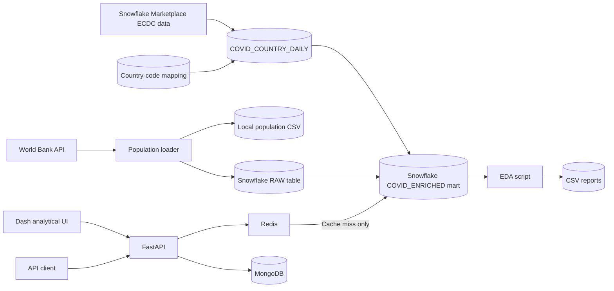

# COVID-19 Analytics Platform

A bootcamp data-engineering project that combines World Bank population data,
Snowflake analytics, a FastAPI service, MongoDB, and Redis. The repository
provides a reproducible development and container environment, Snowflake setup
and transformations, population ingestion, cached analytical APIs, automated
exploratory-data-analysis exports, and a responsive analytical dashboard with
MongoDB annotations.

## Current capabilities

- Creates the Snowflake warehouse, resource monitor, database, and schemas.
- Explores the Snowflake Marketplace COVID-19 dataset and builds staging and
  enriched analytical views.
- Normalizes known country-code mismatches and classifies locations without a
  matching World Bank population record.
- Creates a latest-country reporting snapshot and detects sustained case-growth
  patterns with Snowflake `MATCH_RECOGNIZE`.
- Downloads 2020 country population data from the World Bank API, saves it
  locally, and loads it into Snowflake.
- Runs analytical queries against the included Snowflake mart and exports EDA
  results as CSV files.
- Runs FastAPI, a multi-page Dash interface, MongoDB, and Redis through Compose.
- Exposes cheap liveness/readiness routes and an explicit Snowflake check.
- Serves country, summary, time-series, comparison, and overview data from the
  Snowflake MARTS layer using `COVID_APP_ROLE`.
- Serves combined country and comparison page payloads so charts do not issue
  independent Snowflake-backed requests.
- Caches successful analytical responses in Redis for 24 hours and prevents
  concurrent cache misses from duplicating Snowflake queries.
- Stores canonical country/date annotations in MongoDB with indexed filtering.
- Emits structured JSON logs with request IDs and contains no native Python
  `print()` calls.
- Locks Python dependencies with uv and runs Ruff, isort, and Black locally and
  in GitHub Actions.

Forecasting, clustering, authentication, and user preferences are intentionally
out of scope for this delivery.

## Architecture


```mermaid
flowchart LR
    Market[Snowflake Marketplace ECDC data] --> Staging[(COVID_COUNTRY_DAILY)]
    Mapping[(Country-code mapping)] --> Staging
    WB[World Bank API] --> Loader[Population loader]
    Loader --> CSV[(Local population CSV)]
    Loader --> Raw[(Snowflake RAW table)]
    Staging --> Marts[(Snowflake COVID_ENRICHED mart)]
    Raw --> Marts
    Marts --> EDA[EDA script]
    EDA --> Reports[(CSV reports)]

    Browser[Dash analytical UI] --> API[FastAPI]
    Client[API client] --> API
    API --> Redis
    Redis -->|Cache miss only| Marts
    API --> Mongo[(MongoDB)]
```

## Technology stack

| Area                  | Technology                                     |
| --------------------- | ---------------------------------------------- |
| API                   | FastAPI, Uvicorn                               |
| Web interface         | Plotly Dash and Plotly                         |
| Analytics             | Snowflake SQL, pandas, Snowflake Connector      |
| External data         | World Bank API                                 |
| Operational data      | MongoDB 7.0                                    |
| Cache                 | Redis 7.4                                      |
| Dependency management | uv, `pyproject.toml`, `uv.lock`                |
| Runtime               | Python 3.12.13                                 |
| Containers            | Docker Compose                                 |
| Code quality          | Ruff, isort, Black, pre-commit, GitHub Actions |

## Run the project (step by step)

The easiest way to run this repository is with Docker. This starts the API,
status interface, MongoDB, and Redis together, so you do not need to install
Python or the project's Python packages on your computer.

### 1. Install the required tools

Install:

- [Git](https://git-scm.com/downloads)
- [Docker Desktop](https://www.docker.com/products/docker-desktop/) (Windows or
  macOS), or Docker Engine with the Compose plugin (Linux)

Start Docker, then open a terminal and confirm that it is ready:

```bash
git --version
docker --version
docker compose version
```

Each command should print a version number. If a Docker command fails, make
sure Docker Desktop or the Docker service is running before continuing.

### 2. Open the repository folder

In a terminal, move into the folder that contains this `README.md` file. For
example:

```bash
cd path/to/bootcamp-project
```

All commands below should be run from this folder.

### 3. Create your environment file

Create `.env` from the included template. Use the command for your terminal:

macOS, Linux, or Git Bash:

```bash
cp .env.example .env
```

Windows PowerShell:

```powershell
Copy-Item .env.example .env
```

Skip this step if you already have a configured `.env` file.

### 4. Set the local credentials

Open `.env` in a text editor. To run the API, the three MongoDB settings must
have values:

```dotenv
MONGO_ROOT_USERNAME=covid_admin
MONGO_ROOT_PASSWORD=choose_a_new_alphanumeric_password
MONGO_DATABASE=covid_app
```

Use letters and numbers for the password. Special characters must be URL
encoded because Compose places the password inside a MongoDB connection URL.

Snowflake values can remain placeholders only for `/health/live` and the UI's
initial **Not checked** state. The Snowflake status check and analytical routes
require valid credentials plus `COVID_APP_ROLE`. Do not commit `.env`, because
it contains credentials.

### 5. Build and start the application

Run:

```bash
docker compose up --build -d
```

The first start can take a few minutes while Docker downloads images and builds
the API. The `-d` option keeps the services running in the background.

### 6. Confirm that all services are running

Run:

```bash
docker compose ps
```

The `api`, `dashboard`, `mongo`, and `redis` services should show as running or
healthy. If a service does not start, view its logs:

```bash
docker compose logs api dashboard mongo redis
```

### 7. Create the MongoDB annotation indexes

Run the idempotent setup script after the services are healthy:

```bash
docker compose exec api python -m scripts.setup_mongodb
```

It creates the `annotations` collection when needed and applies the two
non-unique country/date and country/metric indexes. It is safe to run again.

### 8. Test the API and dashboard

Open these addresses in a browser:

- <http://localhost:8000/> - basic API status
- <http://localhost:8000/health/live> - process-only liveness
- <http://localhost:8000/health/ready> - MongoDB and Redis readiness
- <http://localhost:8000/docs> - interactive Swagger API documentation
- <http://localhost:8050> - backend status interface
- <http://localhost:8050/overview> - global analytical overview
- <http://localhost:8050/country> - Country Explorer
- <http://localhost:8050/compare> - country comparison
- <http://localhost:8050/annotations> - MongoDB annotations

A successful health check returns:

```json
{
  "status": "ok"
}
```

The status interface does not contact Snowflake automatically. Selecting
**Check Snowflake** performs one explicit live check that may resume `COVID_WH`.

### 9. Stop the application

When you are finished, stop and remove the containers:

```bash
docker compose down
```

MongoDB and Redis data remain in Docker volumes and will be available the next
time you start the project. To also delete that local data, run
`docker compose down -v`. This second command permanently removes the project's
local MongoDB and Redis volumes.

The Compose configuration is intended for development: it bind-mounts the
repository and starts Uvicorn with automatic reload. Use a separate production
configuration before exposing the service publicly.

### Docker services

| Service | Container     | Host access             | Purpose                |
| ------- | ------------- | ----------------------- | ---------------------- |
| `api`   | `covid_api`   | <http://localhost:8000> | FastAPI application    |
| `dashboard` | `covid_dashboard` | <http://localhost:8050> | Dash analytical UI |
| `mongo` | `covid_mongo` | `127.0.0.1:27017`       | Application data store |
| `redis` | `covid_redis` | Internal only           | API cache dependency   |

Useful operational commands:

```bash
docker compose logs -f api
docker compose restart api
docker compose build api
docker compose exec api python --version
```

## API endpoints

| Method | Path                              | Description                                      |
| ------ | --------------------------------- | ------------------------------------------------ |
| `GET`  | `/health`, `/health/live`         | Process liveness; no dependency calls            |
| `GET`  | `/health/ready`                   | MongoDB and Redis readiness                       |
| `GET`  | `/health/snowflake`               | Explicit uncached Snowflake and MARTS check       |
| `GET`  | `/dashboard/overview`             | Latest global and per-location analytical values |
| `GET`  | `/dashboard/countries/{identifier}` | Combined Country Explorer payload               |
| `GET`  | `/dashboard/compare`              | Combined three-metric comparison payload          |
| `GET`  | `/countries`                      | Canonical country and ISO identities              |
| `GET`  | `/countries/{identifier}/summary` | Latest stored country metrics                     |
| `GET`  | `/countries/{identifier}/timeseries` | Filtered metric points                         |
| `GET`  | `/compare`                        | Two-to-ten-country metric comparison              |
| `POST` | `/annotations`                    | Validate and create a MongoDB annotation           |
| `GET`  | `/annotations`                    | Filter chronological MongoDB annotations           |
| `GET`  | `/docs`                           | Swagger UI                                        |

Analytical responses include `X-Cache: MISS`, `HIT`, or `BYPASS`. Redis is a
budget-protection dependency: if Redis is unavailable while caching is enabled,
analytical routes return `503` without opening a Snowflake connection.

Example acceptance requests:

```bash
curl -i http://localhost:8000/health/live
curl -i http://localhost:8000/health/ready
curl -i http://localhost:8000/health/snowflake
curl -i http://localhost:8000/dashboard/overview
curl -i http://localhost:8000/dashboard/overview
curl -i "http://localhost:8000/dashboard/countries/LV?metric=cases_per_100k&start_date=2020-03-01&end_date=2020-12-14"
curl -i "http://localhost:8000/dashboard/compare?country=LV&country=EE&start_date=2020-03-01&end_date=2020-12-14"
curl -i http://localhost:8000/countries/LV/summary
curl -i "http://localhost:8000/compare?country=LV&country=EE&metric=cases_per_100k&start_date=2020-03-01&end_date=2020-12-14"
```

The first overview call should be `MISS`; the second should be `HIT` and should
not query Snowflake.

### Cache invalidation and query budget

Successful analytical responses are cached for 24 hours. Change
`CACHE_NAMESPACE` when a deployment changes response semantics, or clear only
the current project prefix after refreshing the marts:

```bash
docker compose exec api python -m scripts.clear_cache
```

The script uses incremental Redis `SCAN` calls and never flushes unrelated
Redis data. Redis failures are fail-closed by design: spending Snowflake credits
is not used as an automatic cache fallback.

The Country Explorer loads its complete page response once into:

```python
dcc.Store(id="country-page-data", storage_type="memory")
```

KPI and chart callbacks consume that stored JSON and never make independent API
calls. The comparison and overview pages use the same page-level pattern. The
country catalog and Snowflake status use session stores because they are small
and reused across navigation.

### Annotation workflow

Create or verify the MongoDB indexes:

```bash
docker compose exec api python -m scripts.setup_mongodb
```

Create an annotation through Swagger or curl:

```bash
curl -i -X POST http://localhost:8000/annotations \
  -H "Content-Type: application/json" \
  -d '{"country":"LV","report_date":"2020-03-15","metric":"new_cases","comment":"Reporting delay.","created_by":"Student"}'
```

Read it back:

```bash
curl -i "http://localhost:8000/annotations?country=LV&metric=new_cases&start_date=2020-03-01&end_date=2020-03-31"
```

Creation validates that the country and report date exist in the Snowflake
mart. Successful validation is cached for 24 hours. Annotation lists are read
directly from MongoDB and are never response-cached.

## Local development

This optional workflow requires
[uv](https://docs.astral.sh/uv/getting-started/installation/). uv reads
`.python-version` and can install the project's pinned Python version
automatically.

Install the locked runtime and development dependencies:

```bash
uv sync --locked
uv run python --version
```

Run the API locally only when MongoDB and Redis are available and
`MONGODB_URI` and `REDIS_URL` are set in the shell:

```bash
uv run uvicorn app.main:app --reload
```

The Docker workflow is recommended for API development because Compose creates
those connection strings automatically.

### Dependency management

`pyproject.toml` is the source of declared dependencies. `uv.lock` records the
resolved versions used across environments.

```bash
uv add package-name
uv add --dev development-package
uv lock --check
uv sync --locked
```

Commit both `pyproject.toml` and `uv.lock` whenever dependencies change. Do not
edit `uv.lock` manually.

## Configuration

Copy `.env.example` to `.env` and configure these values:

| Variable              | Required by       | Description                                                     |
| --------------------- | ----------------- | --------------------------------------------------------------- |
| `SNOWFLAKE_ACCOUNT`   | Snowflake scripts | Organization-account identifier returned by the setup SQL       |
| `SNOWFLAKE_USER`      | Snowflake scripts | Snowflake username                                              |
| `SNOWFLAKE_PASSWORD`  | Snowflake scripts | Snowflake password                                              |
| `SNOWFLAKE_ROLE`      | Snowflake scripts | Project role; defaults to `COVID_PROJECT_ADMIN` in code         |
| `SNOWFLAKE_API_ROLE`  | FastAPI            | Least-privilege runtime role; use `COVID_APP_ROLE`              |
| `SNOWFLAKE_WAREHOUSE` | Snowflake scripts | Compute warehouse                                               |
| `SNOWFLAKE_DATABASE`  | Population loader | Connection database; use `COVID_ANALYTICS` with the current SQL |
| `SNOWFLAKE_SCHEMA`    | Population loader | Connection schema; use `RAW` with the current SQL               |
| `SNOWFLAKE_API_SCHEMA` | FastAPI           | Analytical schema; use `MARTS`                                  |
| `MONGO_ROOT_USERNAME` | Docker Compose     | MongoDB root username                                           |
| `MONGO_ROOT_PASSWORD` | Docker Compose     | MongoDB root password                                           |
| `MONGO_DATABASE`      | Docker Compose     | Application database name                                       |
| `MONGODB_URI`         | Local FastAPI      | Local MongoDB connection URI                                    |
| `REDIS_URL`           | API/cache scripts  | Redis connection URI                                            |
| `CACHE_NAMESPACE`     | FastAPI            | Versioned prefix; current default is `covid-api:v2`              |
| `CACHE_TTL_*`         | FastAPI            | Endpoint cache durations; defaults are 86400 seconds            |
| `DASHBOARD_API_BASE_URL` | Dash             | FastAPI base URL used by the status interface                   |
| `DASHBOARD_PUBLIC_API_BASE_URL` | Browser      | Host-visible FastAPI URL used by the Swagger link               |

Compose overrides `MONGODB_URI`, `REDIS_URL`, and the dashboard API URL for
container networking. Never commit `.env`; it is excluded by `.gitignore` and
`.dockerignore`.

## Snowflake pipeline (step by step)

This workflow is optional for running the API health endpoints, but it is
required for the complete analytics pipeline. You need:

- Access to a Snowflake account
- Permission to use `ACCOUNTADMIN` for the initial setup, or help from a
  Snowflake administrator; later steps use `COVID_PROJECT_ADMIN`
- The free Marketplace data installed as
  `COVID19_EPIDEMIOLOGICAL_DATA`
- [uv](https://docs.astral.sh/uv/getting-started/installation/) for the Python
  population loader and EDA script

The SQL files are designed for Snowsight. Open each file in a SQL worksheet,
place the cursor inside one statement, and select **Run**. Run statements one
at a time so that errors and results are easy to inspect.

### 1. Create the Snowflake project objects

Run [`sql/00_project_setup.sql`](sql/00_project_setup.sql). It creates:

- A five-credit monthly resource monitor named `COVID_PROJECT_MONITOR`
- An `XSMALL` warehouse named `COVID_WH`
- The `COVID_ANALYTICS` database
- A least-privilege project role named `COVID_PROJECT_ADMIN`
- A read-only API runtime role named `COVID_APP_ROLE`
- `RAW`, `STAGING`, `MARTS`, and `APP` schemas

The monitor notifies at 50%, suspends the warehouse at 80%, and suspends it
immediately at 100%. Confirm that this quota is appropriate for your account
before running the file. The final query returns the
`PYTHON_ACCOUNT_IDENTIFIER` needed for `.env`; use that
`organization-account` value, not only the account locator.

The setup grants the project role to `SYSADMIN`. If your user still cannot run
`USE ROLE COVID_PROJECT_ADMIN`, ask an account administrator to run the
following after replacing the username:

```sql
GRANT ROLE COVID_PROJECT_ADMIN TO USER YOUR_SNOWFLAKE_USERNAME;
GRANT ROLE COVID_APP_ROLE TO USER YOUR_SNOWFLAKE_USERNAME;
```

FastAPI connects only as `COVID_APP_ROLE`. That role can use `COVID_WH` and
read current and future MARTS tables/views, but it cannot create or replace
project objects.

### 2. Explore and validate the Marketplace data

Run [`sql/01_data_exploration.sql`](sql/01_data_exploration.sql). It verifies
the `ECDC_GLOBAL` columns, previews the source, checks coverage, duplicates,
missing values, and negative corrections, and confirms that `CASES` and
`DEATHS` are daily rather than cumulative values.

If Snowflake reports that `COVID19_EPIDEMIOLOGICAL_DATA` does not exist, add
the free COVID-19 epidemiological dataset from Snowflake Marketplace and make
it available under that exact database name.

### 3. Create the country mapping

Run
[`sql/02_create_country_mapping.sql`](sql/02_create_country_mapping.sql). It
creates and seeds an idempotent mapping table for source naming/code exceptions
such as `EL` to `GR`, `UK` to `GB`, and the missing Namibia code. It also marks
territories and non-country rows that are not expected to match the current
World Bank extract.

### 4. Create and verify the staging view

Run [`sql/03_create_staging_view.sql`](sql/03_create_staging_view.sql). It
creates `COVID_ANALYTICS.STAGING.COVID_COUNTRY_DAILY`, applies the country
mapping, separates ISO-2 and ISO-3 codes, aggregates duplicate country-date
rows, preserves negative source corrections, and calculates cumulative cases
and deaths from the daily values.

### 5. Configure the Python connection

Copy `.env.example` to `.env`, then replace the Snowflake placeholders. The
project defaults are:

```dotenv
SNOWFLAKE_ACCOUNT=organization-account-from-step-1
SNOWFLAKE_USER=your_username
SNOWFLAKE_PASSWORD=your_password
SNOWFLAKE_ROLE=COVID_PROJECT_ADMIN
SNOWFLAKE_WAREHOUSE=COVID_WH
SNOWFLAKE_DATABASE=COVID_ANALYTICS
SNOWFLAKE_SCHEMA=RAW
```

Install the locked dependencies:

```bash
uv sync --locked
```

### 6. Load and verify the World Bank population data

Run the loader from the repository root:

```bash
uv run python scripts/load_population.py
```

It recreates `COVID_ANALYTICS.RAW.WORLD_BANK_POPULATION_2020` and currently
loads 217 rows. Then run
[`sql/04_verify_population_data.sql`](sql/04_verify_population_data.sql) to
check the row count, missing values, and duplicate country codes.

### 7. Create and verify the enriched mart

Run [`sql/05_create_enriched_view.sql`](sql/05_create_enriched_view.sql). It
joins the daily COVID-19 view to population data and creates
`COVID_ANALYTICS.MARTS.COVID_ENRICHED` with cumulative, daily, per-100,000, and
mortality metrics. Its `POPULATION_JOIN_STATUS` distinguishes matched rows,
expected source-unavailable locations, missing codes, and genuine unmatched
records.

### 8. Create reporting objects and run the analyses

Run
[`sql/06_create_reporting_objects.sql`](sql/06_create_reporting_objects.sql)
to build the small `COUNTRY_LATEST_METRICS` transient snapshot and the
`CASE_INCREASE_PATTERNS` view. Re-run this file after refreshing upstream data
so the transient snapshot stays current.

Then run [`sql/07_analysis_queries.sql`](sql/07_analysis_queries.sql) for
per-capita rankings, mortality rankings, the Baltic-country comparison, and
the longest detected runs of daily case increases.

Export the automated EDA reports locally with:

```bash
uv run python scripts/run_eda.py
```

The complete Snowflake object flow is:

```text
COVID19_EPIDEMIOLOGICAL_DATA.PUBLIC.ECDC_GLOBAL
    + COVID_ANALYTICS.RAW.COUNTRY_CODE_MAPPING
    -> COVID_ANALYTICS.STAGING.COVID_COUNTRY_DAILY

World Bank API
    -> COVID_ANALYTICS.RAW.WORLD_BANK_POPULATION_2020

COVID_ANALYTICS.STAGING.COVID_COUNTRY_DAILY
    + COVID_ANALYTICS.RAW.WORLD_BANK_POPULATION_2020
    -> COVID_ANALYTICS.MARTS.COVID_ENRICHED
    -> COVID_ANALYTICS.MARTS.COUNTRY_LATEST_METRICS

COVID_ANALYTICS.STAGING.COVID_COUNTRY_DAILY
    -> COVID_ANALYTICS.MARTS.CASE_INCREASE_PATTERNS
```

## Population ingestion

The population loader requests country metadata and the `SP.POP.TOTL`
indicator for 2020 from the World Bank. It writes
`data/external/world_bank_population_2020.csv` and loads the same rows into
`COVID_ANALYTICS.RAW.WORLD_BANK_POPULATION_2020`.

After completing the Snowflake setup and configuring `.env`, run:

```bash
uv run python scripts/load_population.py
```

The configured warehouse, `COVID_ANALYTICS` database, and `RAW` schema must
already exist. The selected Snowflake role needs permission to use them and to
create and write tables in the schema. Verify the load with
`sql/04_verify_population_data.sql`.

The checked-in CSV currently contains 217 country records with ISO-2, ISO-3,
country name, population, and population year fields.

> **Important:** the loader executes `CREATE OR REPLACE TABLE`, so running it
> replaces the existing `WORLD_BANK_POPULATION_2020` table.

## Exploratory data analysis

The EDA script expects this object to exist before it runs:

```text
COVID_ANALYTICS.MARTS.COVID_ENRICHED
```

Create the mart by running `sql/05_create_enriched_view.sql` after the staging
view and population table are ready. It provides the country, report date,
population, cumulative cases/deaths, per-100,000 metrics, mortality rate, and
negative-correction flags used by `scripts/run_eda.py`.

Run the reports with:

```bash
uv run python scripts/run_eda.py
```

Results are written to the ignored `outputs/eda/` directory:

- `dataset_coverage.csv`
- `missing_population.csv`
- `data_corrections.csv`
- `latest_country_metrics.csv`

## PySpark Bronze and profiling demonstration

Spark is isolated from the production API. At the current approximately
61,900-row scale, pandas or Snowflake SQL are simpler and cheaper; this path
demonstrates explicit schemas, immutable Bronze storage, quality rules,
broadcast joins, physical-plan inspection, and measured layout decisions.

The pinned runtime is Python 3.12.13, PySpark 3.5.6, Java 17.0.19, and uv
0.11.29. Normal API containers do not contain Java or PySpark. The optional
Spark service runs one local application with two execution threads through
`local[2]`.

### 1. Export one reusable source batch

Complete the Snowflake setup, load population data, and configure `.env` for
the project-admin role. Then run:

```bash
uv run python scripts/export_spark_sources.py \
  --source-batch-id ecdc-2020-v1
```

This is the only Spark workflow step that contacts Snowflake. It opens one
connection, executes two required-column statements, copies the local
population snapshot, and writes `data/source/ecdc-2020-v1/`. Its manifest
contains row counts, byte counts, and SHA-256 checksums. Existing batch IDs are
never overwritten.

### 2. Build and run the pinned Spark container

```bash
docker compose --profile spark build spark

docker compose --profile spark run --rm spark ingest-profile \
  --source-batch-id ecdc-2020-v1 \
  --ingestion-id bronze-v1 \
  --benchmark-run-id benchmark-v1
```

The job validates exact headers, applies explicit schemas, preserves all input
and corrupt records in immutable Bronze Parquet, profiles each source,
aggregates duplicate normalized country/date rows, applies null-safe mappings,
and broadcast-joins typed population keys such as `ISO2:LV`.

Bronze is written to `data/bronze/ingestion_id=bronze-v1/`; successful curated
output is written to `data/curated/ingestion_id=bronze-v1/`; local quality,
event-log, plan, and benchmark artifacts go to `outputs/spark/benchmark-v1/`.
Both the ingestion and benchmark IDs are immutable, so choose unused IDs when
repeating the commands.

The `bronze-quality-v1` rules have deterministic publication behavior:

- Schema drift, corrupt input, missing required values, invalid ISO lengths,
  duplicate mapping/population keys, and non-positive population are failures.
- Null daily measures, duplicate normalized dates, and recoverable missing ISO
  values are warnings.
- Negative cases and deaths are informational corrections and remain unchanged.

Schema failures publish only quality evidence. Other failures publish Bronze
and quarantine evidence but block curated output. Warnings permit curated
publication. Bronze manifest version 2 stores the ruleset, quality status, and
quality-document checksum, allowing later benchmarks to run without retaining
the original benchmark output directory.

### 3. Repeat benchmarks without rewriting Bronze

```bash
docker compose --profile spark run --rm spark benchmark \
  --ingestion-id bronze-v1 \
  --benchmark-run-id benchmark-v2
```

Each comparison performs one warm-up and five measured repetitions in one JVM,
alternating variant order. Results include individual durations, median, range,
input and shuffle bytes, partitions, and output file counts. Before timing, both
variants must pass an exact correctness gate covering ordered schema, row count,
and an order-independent SHA-256 row-multiset checksum. Correctness work is not
included in benchmark durations.

If a gate fails, the run exits nonzero and writes a sanitized
`correctness_failure.json` inside that run's output directory. Warm-up and
measured actions are skipped, and the committed evidence file is unchanged.
Benchmark-only mode requires Bronze manifest version 2; legacy version 1
ingestions must be recreated from their local immutable source batch.

Final file count is derived from measured Parquet bytes with a 128 MiB target.
Year/month directories are used only when monthly partitions are sufficiently
large and bounded in cardinality. This dataset should remain unpartitioned and
coalesce to one file.

Only a completely passing suite atomically publishes
`reports/spark/evidence.json`. Evidence version 2 records the fingerprint
protocol and a passing correctness block for all five comparisons. Raw Marketplace extracts,
Parquet data, event logs, complete plans, and scratch output remain ignored.
The summary contains source and plan hashes without credentials, account names,
SQL, raw rows, or local paths.

Run the Spark fixture suite with:

```bash
uv sync --locked --group spark
uv run --group spark python -m unittest discover -s spark_tests -v
```

## Code quality and CI

Install the Git hook once:

```bash
uv run pre-commit install
```

Run every quality check manually:

```bash
uv run pre-commit run --all-files
```

Individual CI-equivalent commands are:

```bash
uv run isort --check-only --diff .
uv run black --check --diff .
uv run ruff check .
uv run python -m unittest discover -s tests -v
```

The GitHub Actions workflow runs the locked Python environment and all three
checks on every push and pull request.

## Repository structure

```text
.
|-- app/
|   |-- api/                            # Health, analytical, annotation routes
|   |-- dashboard/                      # Multi-page Dash interface
|   |-- models/                         # Pydantic response contracts
|   |-- repositories/                   # Snowflake and MongoDB access
|   |-- services/                       # Cache, analytics, annotations
|   |-- spark_pipeline/                 # Bronze, profiling, transformations
|   |-- config.py                       # Typed environment settings
|   |-- logging_config.py               # Structured JSON logging
|   `-- main.py                         # FastAPI factory and lifespan
|-- data/external/
|   `-- world_bank_population_2020.csv  # Population snapshot
|-- scripts/
|   |-- clear_cache.py                   # Prefix-scoped Redis invalidation
|   |-- export_spark_sources.py          # Snowflake -> immutable local batch
|   |-- load_population.py              # World Bank -> CSV/Snowflake
|   |-- run_eda.py                       # Snowflake mart -> CSV reports
|   |-- run_spark_bronze.py              # Spark ingest/profile/benchmark CLI
|   `-- setup_mongodb.py                 # Annotation collection and indexes
|-- sql/
|   |-- 00_project_setup.sql             # Monitor, warehouse, DB, schemas
|   |-- 01_data_exploration.sql          # Marketplace source checks
|   |-- 02_create_country_mapping.sql    # Normalize country/code exceptions
|   |-- 03_create_staging_view.sql       # Clean daily and cumulative metrics
|   |-- 04_verify_population_data.sql    # Population load checks
|   |-- 05_create_enriched_view.sql      # Population-enriched analytics mart
|   |-- 06_create_reporting_objects.sql  # Latest snapshot and pattern view
|   `-- 07_analysis_queries.sql          # Final analytical queries
|-- .env.example                        # Configuration template
|-- .pre-commit-config.yaml             # Local Git hooks
|-- .python-version                     # Exact local/CI Python pin
|-- tests/                              # Focused API, cache, repository tests
|-- compose.yaml                         # API, dashboard, MongoDB, Redis
|-- dockerfile                          # API image
|-- dockerfile.spark                    # Pinned Java/PySpark image
|-- pyproject.toml                       # Project metadata and dependencies
`-- uv.lock                              # Resolved dependency lockfile
```

## Troubleshooting

### Docker cannot connect to the daemon

Start Docker Desktop and wait until the Linux container engine is ready. Verify
it with `docker version`, which should show both Client and Server sections.

### The API health endpoint returns `503`

Inspect dependency health and API logs:

```bash
docker compose ps
docker compose logs mongo redis api
```

Confirm the MongoDB credentials in `.env`, then recreate the stack if they were
changed. Existing MongoDB volumes retain the credentials used at first
initialization.

### A pre-commit hook modifies files

This is expected for Ruff, isort, and Black. Review and stage the updated files,
then rerun the command until every hook passes:

```bash
git add <updated-files>
uv run pre-commit run --all-files
```

### The lockfile is out of date

After an intentional dependency change, regenerate and verify it:

```bash
uv lock
uv lock --check
```
