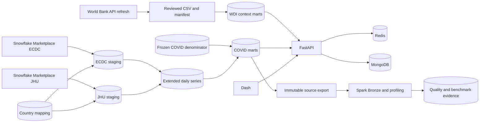

# Project overview

The project combines a warehouse pipeline, an API, a dashboard, a cache, an annotation store, and a Spark workflow.

## Capabilities

- Create a Snowflake warehouse, resource monitor, database, schemas, and least-privilege roles.
- Read ECDC and normalized JHU data from Snowflake Marketplace.
- Preserve negative case and death corrections.
- Publish versioned World Development Indicators (WDI) data.
- Keep WDI context separate from the frozen COVID rate denominator.
- Build daily, cumulative, per-capita, mortality, and country-context marts.
- Detect sustained case increases with Snowflake `MATCH_RECOGNIZE`.
- Serve typed FastAPI endpoints and a six-page Dash application.
- Cache analytical responses with Redis.
- Store indexed annotations in MongoDB.
- Compare two forecast models with temporal validation.
- Build immutable Spark Bronze data and benchmark evidence.
- Run code checks and tests in GitHub Actions.

The project does not include clustering, authentication, or user preferences.

## Architecture



The production API reads the extended marts by default. Set `COVID_DATASET=legacy` to read the ECDC-only marts.

Redis protects the Snowflake query budget. Analytical routes fail when Redis is unavailable.

MongoDB stores annotations only. Snowflake remains the source for analytical data.

## Technology stack

| Area | Technology |
| --- | --- |
| API | FastAPI and Uvicorn |
| Dashboard | Plotly Dash and Plotly |
| Warehouse | Snowflake SQL |
| Data processing | pandas and PySpark 3.5.6 |
| External data | World Bank API |
| Annotation store | MongoDB 7.0 |
| Cache | Redis 7.4 |
| Runtime | Python 3.12.13 |
| Dependencies | uv, `pyproject.toml`, and `uv.lock` |
| Containers | Docker Compose |
| Quality | Ruff, isort, Black, pre-commit, and GitHub Actions |

## Repository structure

```text
.
|-- app/
|   |-- api/                             # Health, analytics, and annotation routes
|   |-- dashboard/                       # Dash pages and charts
|   |-- models/                          # Pydantic contracts
|   |-- repositories/                    # Snowflake and MongoDB access
|   |-- services/                        # Cache, analytics, forecast, and annotations
|   |-- spark_pipeline/                  # Bronze, quality, and benchmark code
|   |-- world_bank.py                    # WDI contracts and checksums
|   |-- config.py                        # Typed settings
|   `-- main.py                          # FastAPI application
|-- data/external/
|   |-- world_bank_indicators_2019_2021.csv
|   `-- world_bank_population_2020.csv
|-- docs/
|   |-- architecture/
|   |   `-- world-bank-context.md        # WDI architecture decision
|   |-- analytics.md
|   |-- api-reference.md
|   |-- configuration.md
|   |-- data-sources.md
|   |-- development.md
|   |-- manual-setup.md
|   |-- project-overview.md
|   |-- spark.md
|   `-- troubleshooting.md
|-- scripts/
|   |-- bootstrap.py                     # Guided setup
|   |-- clear_cache.py                   # Prefix-scoped cache removal
|   |-- export_spark_sources.py          # Snowflake source export
|   |-- run_eda.py                       # EDA CSV export
|   |-- run_spark_bronze.py              # Spark command-line entry point
|   |-- setup_mongodb.py                 # MongoDB indexes
|   |-- update_covid_denominator.py      # Denominator lifecycle
|   `-- world_bank_indicators.py         # WDI refresh and publication
|-- sql/
|   |-- 00_project_setup.sql
|   |-- 00_project_objects.sql
|   |-- 01_data_exploration.sql
|   |-- 02_create_country_mapping.sql
|   |-- 03_create_staging_view.sql
|   |-- 04_create_world_bank_context.sql
|   |-- 05_create_enriched_view.sql
|   |-- 06_create_reporting_objects.sql
|   |-- 07_analysis_queries.sql
|   |-- 08_migrate_population_compatibility.sql
|   `-- 09_create_jhu_extension.sql
|-- tests/                               # Application tests
|-- spark_tests/                         # Spark tests
|-- .env.example                         # Configuration template
|-- compose.yaml                         # Application services
|-- compose.setup.yaml                   # Temporary setup service
|-- dockerfile                           # API image
|-- dockerfile.spark                     # Spark image
|-- pyproject.toml                       # Dependencies and tool settings
`-- uv.lock                              # Resolved dependency lock
```

## Related documents

- [Data sources](data-sources.md)
- [API reference](api-reference.md)
- [World Bank country context](architecture/world-bank-context.md)
- [Spark workflow](spark.md)
